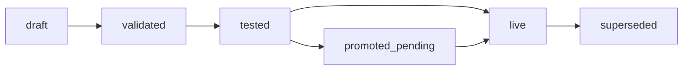

# Capability evolution pipeline

When you install a user-authored capability (for example **`app-live-review`**, **`preview-review`**, or any CDK package), the install moves through an **evolution pipeline** before agents and the runtime canvas can use it.

Open the install in **Configure → [space] → Capabilities → [install]** — you see the state strip, action buttons, and (when relevant) a contract diff panel.

---

## What the states mean



| State | Meaning | Runtime available? |
|-------|---------|-------------------|
| **`draft`** | Bundle pushed (or installed). Artifact is registered but not checked. | No — MCP tools and `/api/*` routes are **not** mounted. |
| **`validated`** | Offline checks passed (manifest, contract shape, MCP tool map). | No |
| **`tested`** | Contract/reachability tests passed. | No |
| **`promoted_pending`** | Breaking semver promote waiting on a **human gate** (usually production). | No — approve the gate first. |
| **`live`** | Worker spawned, routes mounted, UI bundle served, MCP catalog updated. | **Yes** |
| **`superseded`** | A newer version replaced this install as live. | No (historical row) |

The highlighted pills in the UI show progress: filled = reached, grey = not yet.

---

## End-to-end: from push to live

Use **`app-live-review`** (or your package id) as the running example.

### Step 0 — Push (creates `draft`)

On your machine, from the capability project:

```bash
export STUDIO_HUB_URL=http://127.0.0.1:8787
export STUDIO_TOKEN=tok_your_admin_grant
export STUDIO_SPACE_ID=spc_ui_sandbox

studio capability validate . --json
studio capability build .
studio capability push --space spc_ui_sandbox --json
```

Record **`install_id`** from the push output or `studio capability status . --json`.

**Browser:** **Configure → Capabilities** — the row shows `app-live-review v… — draft`.

---

### Step 1 — Validate → `validated`

**What it does:** Runs Lens A checks on the bundle — manifest schema, contract graph, MCP tools mapped in `contract/mcp-tools.json`, bundled files present.

**Browser:** Open the install → click **Validate**. The pipeline advances to **`validated`**.

**CLI:**

```bash
studio capability validate --space spc_ui_sandbox --install ins_… --json
```

**When it fails:** Fix errors locally (`studio capability validate .`), rebuild, push again (same semver updates the draft install).

---

### Step 2 — Test → `tested`

**What it does:** Runs the capability's contract test entry (Vitest reachability / integration declared in the manifest).

**Browser:** Click **Test**. State becomes **`tested`**.

**CLI:**

```bash
studio capability test --space spc_ui_sandbox --install ins_… --json
```

---

### Step 3 — Promote → `live` or `promoted_pending`

**What it does:** Approves the install for production use in this space.  
**Non-breaking** version (e.g. `2.0.0` → `2.1.0`): state goes directly to **`live`** in the database.  
**Breaking** major bump (e.g. `2.x` → `3.x`): state becomes **`promoted_pending`** and a **gate** is created for human approval.

**Browser:** Click **Promote**.

**CLI:**

```bash
studio capability promote --space spc_ui_sandbox --install ins_… --json
```

If you land on **`promoted_pending`**:

1. Note the gate link on the pipeline (**Open gate queue**), or go to **Runtime → Gates** on the target space (often `ui-production`).
2. **Approve** the gate.
3. Continue to Step 4.

::: warning Promote ≠ mounted yet
**Promote updates evolution state only.** It does **not** spawn the capability worker or register MCP tools. You still need **Apply live** (Step 4) for CDK bundles.
:::

---

### Step 4 — Apply live → actually `live` at runtime

**What it does:**

1. Spawns the capability worker with your `server/mount.mjs`
2. Proxies HTTP under `routes_prefix` (e.g. `/api/app-live-review/*`)
3. Serves the UI bundle at `/capabilities/{package}/{version}/ui/*`
4. Rebuilds the MCP tool catalog for the space
5. Sets evolution state to **`live`** if apply succeeds

**CLI (required today for CDK bundles):**

```bash
studio capability apply --space spc_ui_sandbox --install ins_… --json
```

There is no **Apply live** button in the Configure UI yet — use the CLI after Validate → Test → Promote.

**Verify:**

```bash
curl -s -H "Authorization: Bearer $STUDIO_TOKEN" \
  "$STUDIO_HUB_URL/v1/spaces/spc_ui_sandbox/capabilities/live" | jq .
```

Expect `app-live-review` in `mounts`. Then check a route:

```bash
curl -s -H "Authorization: Bearer $STUDIO_TOKEN" \
  "$STUDIO_HUB_URL/api/app-live-review/health"
```

Reload MCP in your agent client — tools from `app-live-review` should appear (grant ACL must include the package id).

---

## Contract diff panel

Below the buttons you may see:

> **Contract diff (2.0.0 → 3.0.0)**  
> Breaking: new gate state added  
> States added: 1

**What it is:** A preview of contract changes between two semver versions — new/removed states, changed transitions, breaking summary. It helps you decide whether promote will require a gate.

**How to read it:**

| Field | Meaning |
|-------|---------|
| **Summary** | Human-readable breaking / non-breaking verdict |
| **States added / removed** | Contract v2 state machine diff |
| **Transitions changed** | Count of edited edges |

The panel uses the space's contract diff API (`GET /v1/spaces/{id}/contracts/diff?from=…&to=…`). For your own package, compare the version you have live vs the version you are promoting.

A breaking diff + major semver → expect **`promoted_pending`** after Promote.

---

## Quick reference

| Goal | Browser | CLI |
|------|---------|-----|
| Upload bundle | — | `studio capability push --space …` |
| Validate | **Validate** | `studio capability validate --space … --install …` |
| Test | **Test** | `studio capability test --space … --install …` |
| Promote | **Promote** | `studio capability promote --space … --install …` |
| Mount worker + MCP | — | `studio capability apply --space … --install …` |
| Approve breaking gate | **Runtime → Gates → Approve** | — |

---

## Troubleshooting

| Symptom | Likely cause | Fix |
|---------|--------------|-----|
| State says `live` but MCP tools missing | Promoted without **Apply live** | Run `studio capability apply …` |
| Stuck on `promoted_pending` | Gate not approved | **Runtime → Gates** on production space |
| `BUNDLE_DIGEST_MISMATCH` on push | Stale stage / digest sidecar | `studio capability build .` then push again |
| Canvas blank / 404 on static assets | Build did not copy `ui/crit/` etc. | Rebuild with current SDK; check `shell.html` links |
| Validate button no-op | Install not in `draft` | Push a new draft or use CLI with correct `install_id` |

---

## Related

- [Configuration](./configuration) — admin checklist
- [Browser app — Capabilities](./browser#configure--capabilities)
- [Capabilities tutorial](./capabilities-tutorial) — Part 7–8 push and evolution
- [Agent skill](./agent-skill) — teaches coding agents this pipeline
- [Capability SDK reference](../reference/capability-sdk)
