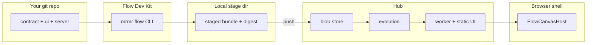

# Flows tutorial

This guide walks you through authoring, building, pushing, and running a **user-created flow** — a versioned workflow package with contract, HTTP routes, MCP tools, and canvas UI.

::: tip Who this is for
**Builders** — teams who define their own workflows in **their own git repo**, using the **Flow Dev Kit (FDK)** (`@murrmure/cli`).

**Not** for cloning the Murrmure platform monorepo. Domain UI and handlers live in **your project**; the platform shell only hosts Configure, thin runtime chrome, and a sandboxed canvas iframe.
:::

::: info Prerequisites
- Node.js 20+
- A running Murrmure hub ([self-hosted](./self-hosted) or cloud)
- Admin or `flow:install` grant on a sandbox space
- Hub URL + token in env or `~/.murrmure/hubs/shared.json`
:::

---

## What is a flow?

A flow is everything needed to run one workflow in a space:

| Layer | File(s) | Purpose |
|-------|---------|---------|
| **Manifest** | `flow.manifest.json` | Package id, version, routes, UI entry, MCP tool map |
| **Contract** | `contract/contract.json` | State machine (ContractV2) — instances, transitions, gates |
| **Config schema** | `contract/config.schema.json` | Install-time fields shown in Configure |
| **MCP registry** | `contract/mcp-tools.json` | Tool names, HTTP bindings, input schemas |
| **UI** | `ui/src/mount.tsx` | Canvas rendered inside a **sandboxed iframe** |
| **Server** | `server/index.ts` | HTTP routes mounted in a **flow worker** subprocess |

The platform provides evolution (validate → test → promote → apply), auth, MCP catalog, and the canvas host. **You** provide domain meaning.



---

## Part 1 — Install the FDK

In **your workflow repo** (any directory — not the Murrmure monorepo):

```bash
npm install -D @murrmure/cli
npm install @murrmure/flow-dev-kit
```

The package exposes:

| Export | Use |
|--------|-----|
| `@murrmure/cli` | Schemas, `validateFlowRoot`, `buildFlowRoot` |
| `@murrmure/flow-dev-kit` | Runtime bridge helpers + React mount helpers |
| `@murrmure/flow-dev-kit/react` | Provider/hooks + default error UI primitives |
| `@murrmure/flow-dev-kit/host` | `FlowHostContext` type for UI `mount()` |
| `@murrmure/flow-dev-kit/server` | `FlowServerContext` type for `mountRoutes()` |
| `murrmure` / `mrmr` bin | CLI |

Configure hub auth (pick one):

```bash
# Option A — environment
export MURRMURE_HUB_URL=http://127.0.0.1:8787
export MURRMURE_TOKEN=tok_your_admin_or_install_grant
export MURRMURE_SPACE_ID=spc_ui_sandbox

# Option B — ~/.murrmure/hubs/shared.json
```

```json
{
  "url": "http://127.0.0.1:8787",
  "token": "tok_…",
  "defaultSpaceId": "spc_ui_sandbox"
}
```

Verify connectivity:

```bash
npx mrmr flow doctor --json
```

---

## Part 2 — Scaffold a flow

```bash
mrmr flow init review-loop-lite --dir ./workflows/review-loop-lite --install
cd workflows/review-loop-lite
```

This creates:

```
workflows/review-loop-lite/
  package.json                  # exact-pinned scaffold deps + scripts
  flow.manifest.json      # schemaVersion "1"
  murrmure.flow.yaml        # optional display metadata
  playwright.config.ts          # e2e runner against dev --sim
  contract/
    contract.json               # ContractV2 state machine
    config.schema.json          # Configure install form
    mcp-tools.json              # MCP tool → HTTP map
  ui/
    shell.html                  # iframe bootstrap + bridge
    src/App.tsx                 # strict React root
    src/mount.tsx               # Canvas entry (iframe)
    src/components/error/
      FlowErrorBoundary.tsx
      FlowErrorState.tsx
  server/
    index.ts                    # mountRoutes(app, ctx)
  tests/
    contract/
      reachability.test.ts
    e2e/
      canvas.spec.ts
      harness/
        simulated-shell.ts
        simulated-murrmure-machine.ts
```

**Rules:**

- `flow.manifest.json` → `id` must match kebab-case (`review-loop-lite`)
- Do **not** put `contract_ref_id` in the author manifest — the hub assigns it at ingest
- `routes_prefix` must be unique per live flow in a space (e.g. `/api/review-loop-lite`)
- scaffold dependencies use **exact pins** (no `^` / `~`) and include both `@murrmure/cli` + `@murrmure/flow-dev-kit`

Scaffolded scripts:

- `npm run validate:flow`
- `npm run build:flow`
- `npm run dev:flow` (simulated mode)
- `npm run test:unit`
- `npm run test:e2e`

---

## Part 3 — Author the contract

Edit `contract/contract.json` using **ContractV2** shape:

```json
{
  "schemaVersion": "2.0",
  "id": "review-loop-lite",
  "version": "0.1.0",
  "initial_state": "draft",
  "terminal_states": ["done"],
  "metadata_schema": {
    "type": "object",
    "properties": { "title": { "type": "string" } }
  },
  "states": [
    { "id": "draft", "kind": "active" },
    { "id": "review", "kind": "active" },
    { "id": "done", "kind": "terminal" }
  ],
  "transitions": [
    {
      "id": "submit",
      "from": "draft",
      "to": "review",
      "event": "submit",
      "actors": ["agent:*", "human:*"],
      "condition": null,
      "gate": null,
      "emit": ["submitted"]
    }
  ],
  "events": {
    "declarations": [
      { "type": "submitted", "schema": { "type": "object" } }
    ]
  }
}
```

Instances are created with the hub-assigned `contract_ref_id` (derived from package id + contract major version). Agents call platform MCP tools (`transition`, `emit_event`) against that instance — your server routes handle domain HTTP.

---

## Part 4 — Declare MCP tools

`contract/mcp-tools.json` maps tool names to HTTP routes your server implements:

```json
{
  "tools": {
    "ping": {
      "description": "Health check",
      "http": { "method": "GET", "path": "/health" },
      "input_schema": { "type": "object", "properties": {} }
    }
  }
}
```

Every name listed under `mcp_tools_by_version[your semver]` in the manifest **must** exist here. The hub rebuilds the MCP catalog from this file on live apply.

---

## Part 5 — Write UI and server mounts

### UI (`ui/src/mount.tsx`)

Loaded inside a **sandboxed iframe** (`sandbox="allow-scripts"`, no same-origin). Talk to the hub via `postMessage` bridge or relative fetches to hub-served static assets.

```typescript
import type { FlowHostContext } from "@murrmure/flow-dev-kit/host";
import { createFlowMount } from "@murrmure/flow-dev-kit";
import { App } from "./App";
import { FlowErrorBoundary } from "./components/error/FlowErrorBoundary";

const mountReactApp = createFlowMount({
  App,
  Boundary: FlowErrorBoundary,
});

export function mount(root: HTMLElement, ctx: FlowHostContext): () => void {
  return mountReactApp(root, ctx);
}
```

The shell sends `{ type: "init", ctx: FlowHostContextPublic }` after iframe load. On dev reload or live apply, it sends `{ type: "reload" }`.

### Server (`server/index.ts`)

Runs in a **flow worker subprocess** — never in the hub main process.

```typescript
import type { Hono } from "hono";
import type { FlowServerContext } from "@murrmure/flow-dev-kit/server";

export function mountRoutes(app: Hono, ctx: FlowServerContext): void {
  app.get("/health", (c) =>
    c.json({ ok: true, package: ctx.packageId, version: ctx.version }),
  );
}
```

Routes are mounted under `routes_prefix` from the manifest (e.g. `GET /api/review-loop-lite/health`).

---

## Part 6 — Validate and build

### Offline validate (Lens A)

```bash
mrmr flow validate . --json
```

Blocking errors include:

| Code | Meaning |
|------|---------|
| `MANIFEST_INVALID` | Schema or missing files |
| `GRAPH_UNREACHABLE` | Contract state not reachable (legacy graph only) |
| `MCP_TOOL_UNMAPPED` | Tool in manifest not in `mcp-tools.json` |
| `MOUNT_EXPORT_MISSING` | Missing bundled ui/server after build |
| `UI_BUNDLE_FAILED` | UI esbuild error |
| `SERVER_BUNDLE_FAILED` | Server esbuild error |
| `UI_ASSET_MISSING` | `shell.html` references a file not copied into staged `ui/` |
| `DEVKIT_VERSION_REQUIRED` | `@murrmure/flow-dev-kit` missing from `package.json` |
| `DEVKIT_VERSION_NOT_EXACT` | Required scaffold dependency uses a range |
| `DEVKIT_SDK_VERSION_MISMATCH` | SDK and dev-kit versions do not match |

Warnings (non-blocking offline): `TESTS_MISSING`, `GATE_ROLE_UNKNOWN`.

### Build and stage

```bash
mrmr flow build .
```

Output:

```
~/.murrmure/flows/{package_id}/{version}/
  manifest.json
  contract/
  ui/shell.html + ui/entry.js + static assets (crit/, agent/, fonts, …)
  server/mount.mjs
  bundle.digest              # sha256:…
  build.meta.json
```

**UI static convention:** everything under `ui/` except `ui/src/` is copied into the stage as-is. React/TS under `ui/src/` is bundled into `ui/entry.js`. Link static files from `shell.html` with relative paths (e.g. `./crit/style.css`). Optional manifest field `ui.assets` restricts copy to explicit paths.

Re-run validate on the stage (post-build):

```bash
mrmr flow validate ~/.murrmure/flows/review-loop-lite/0.1.0 --json
```

---

## Part 7 — Push to a space (draft)

```bash
mrmr flow push --space spc_ui_sandbox --json
```

This calls install v2:

```http
POST /v1/spaces/{space_id}/flows/install
```

with `bundle.mode: local-path` (same-machine hub reads staged bytes and computes digest).

On success the CLI writes:

```
~/.murrmure/flows/{id}/{version}/.push-state.json
```

```json
{
  "install_id": "ins_…",
  "space_id": "spc_ui_sandbox",
  "package_id": "review-loop-lite",
  "version": "0.1.0",
  "bundle_digest": "sha256:…",
  "contract_ref_id": "cref_review_loop_lite_2",
  "pushed_at": "2026-06-21T12:00:00Z"
}
```

Push always targets **`draft`**. Agents may push to sandbox spaces only (not production with `human_only` policy).

Check status:

```bash
mrmr flow status . --json
mrmr flow list --space spc_ui_sandbox --json
```

---

## Part 8 — Evolution pipeline

Run from CLI or **Configure → [space] → Flows → [install]**.

Full step-by-step (states, contract diff, gates): **[Flow evolution pipeline](./flow-evolution)**.

| Step | CLI | Configure button | Result state |
|------|-----|------------------|--------------|
| Push | `mrmr flow push --space …` | — | `draft` |
| Validate | `mrmr flow validate --space … --install ins_…` | Validate | `validated` |
| Test | `mrmr flow test --space … --install ins_…` | Test | `tested` |
| Promote | `mrmr flow promote --space … --install ins_…` | Promote | `promoted_pending` or `live`* |
| Apply | `mrmr flow apply --space … --install ins_…` | *(CLI only)* | `live` at runtime |

\*Promote sets DB state; **Apply** mounts the worker and MCP catalog. Do not skip apply for FDK bundles.

Example (using `install_id` from `.push-state.json`):

```bash
INSTALL=ins_…
SPACE=spc_ui_sandbox

mrmr flow validate --space $SPACE --install $INSTALL --json
mrmr flow test --space $SPACE --install $INSTALL --json
mrmr flow promote --space $SPACE --install $INSTALL --json
mrmr flow apply --space $SPACE --install $INSTALL --json
```

**Apply live** (when state is `promoted` or ready):

1. Spawns flow worker with your `server/mount.mjs`
2. Registers HTTP proxy under `routes_prefix`
3. Serves UI at `GET /flows/{pkg}/{ver}/ui/*`
4. Rebuilds MCP catalog from bundle
5. Emits `flow.live_applied` on the control bus

Breaking semver promotes may require a human gate on production spaces.

---

## Part 9 — Runtime: canvas and MCP

### Mint agent grants

**Configure → [space] → Agent grants → Mint grant**

Include your `package_id` in **`flow_acl`** so MCP tools appear:

```json
["review-loop-lite"]
```

Worker template scopes: `state:transition`, `event:emit`, `space:read`, …

### Create an instance

Agents use platform + flow MCP tools. After your domain tool creates work, an **instance** row appears under **Runtime → Instances**.

### Open the canvas

For live bundle flows, the shell loads:

```
{hub}/flows/{package_id}/{version}/ui/shell.html?instance={instance_id}
```

inside `FlowCanvasHost` (sandboxed iframe). No domain UI is compiled into `@murrmure/shell-web`.

### Verify

| Check | How |
|-------|-----|
| Live mount | `GET /v1/spaces/{id}/flows/live` |
| HTTP routes | `curl $HUB/api/your-prefix/health -H "Authorization: Bearer $TOKEN"` |
| MCP tools | Reload MCP in Cursor; grant ACL must include package |
| UI bundle | Open canvas link from Instances list |

---

## Part 10 — Local dev loops

### Connected loop (`--space`)

Watch source, validate, build, push, and optionally apply:

```bash
mrmr flow dev . --space spc_ui_sandbox
```

Options:

- `--auto-apply` — call apply after each successful push when already live
- Debounce is 300ms on file changes

### Simulated loop (`--sim`)

Run local workflow UI testing **without** a running hub:

```bash
mrmr flow dev . --sim --port 4310
```

What it starts:

- thin local shell page with iframe canvas host
- simulated `hub-fetch` bridge
- **flow server routes** at `{routes_prefix}/*` (loads bundled `server/mount.mjs`, same mount contract as hub worker)
- simulated install lifecycle (`draft -> validated -> tested -> promoted -> live`)
- simulated instance lifecycle transitions with revision-aware errors
- UI static serving: staged bundle first, source `ui/` fallback during dev

Useful simulator endpoints:

- `GET {routes_prefix}/health` — flow server mount (e.g. `/api/my-flow/health`)
- `GET /sim/install`
- `POST /sim/install/transition` (body: `{ "action": "validate|test|promote|apply" }`)
- `GET /sim/instances`
- `POST /sim/instances/:id/transition`
- `GET /sim/fixtures`
- `POST /sim/fixtures/:fixture/apply`

Run scaffolded E2E against simulated mode:

```bash
npm run test:e2e
```

`playwright.config.ts` uses `npm run dev:flow` as the web server command.

---

## Manifest reference (v1)

```json
{
  "schemaVersion": "1",
  "id": "review-loop-lite",
  "version": "0.1.0",
  "routes_prefix": "/api/review-loop-lite",
  "ui": {
    "entry": "ui/entry.js",
    "canvas_route": "/spaces/:spaceId/instances/:instanceId/canvas/review-loop-lite",
    "shell_html": "ui/shell.html"
  },
  "server": { "mount_module": "server/mount.mjs" },
  "mcp_tools_by_version": {
    "0.1.0": ["ping"]
  },
  "config_schema": "contract/config.schema.json",
  "tests": { "contract": "tests/contract/reachability.test.ts" }
}
```

| Field | Notes |
|-------|-------|
| `schemaVersion` | Must be `"1"` for FDK flows |
| `contract_ref_id` | **Do not author** — hub assigns at ingest |
| `mcp_tools_by_version` | Semver key → tool name list |
| `ui.canvas_route` | Used by shell for instance links |

---

## CLI command reference

| Command | Description |
|---------|-------------|
| `mrmr flow init <id> [--dir path] [--install]` | Scaffold strict React project tree |
| `mrmr flow validate [path] [--json]` | Offline Lens A |
| `mrmr flow build [path]` | Bundle → `~/.murrmure/flows/` |
| `mrmr flow push --space <id>` | Install v2 draft + `.push-state.json` |
| `mrmr flow status [path] [--json]` | Read push state |
| `mrmr flow list --space <id> [--json]` | List installs |
| `mrmr flow doctor [--json]` | Hub reachability + token scopes |
| `mrmr flow test\|promote\|apply\|rollback --space … --install …` | Evolution HTTP parity |
| `mrmr flow dev [path] --space <id> [--auto-apply]` | Connected watch + rebuild + push |
| `mrmr flow dev [path] --sim [--port <n>]` | Local sim shell + server mount + FSM |
| `mrmr flow dev [path] --sim [--port <n>] [--fixture <name>]` | Local simulated shell + state machines |

All commands support `--json` for agents and CI.

---

## Monorepo vs user project

| Topic | Old model (platform repo) | FDK model (this tutorial) |
|-------|---------------------------|---------------------------|
| Source location | `examples/flows/*` in monorepo | Your git repo |
| Shell UI | Imported in `@murrmure/shell-web` | Hub-served iframe bundle |
| Install | Bundled catalog picker | `mrmr flow push` |
| Hub registration | Automatic from pushed bundle | Automatic from pushed bundle |
| Server code | Worker subprocess + host-bridge | Worker subprocess + host-bridge |

Reference examples (`review-loop`, `feature-spec`) live under `examples/flows/`
and run as worker bundles — use them as templates for new workflows.

---

## Troubleshooting

| Symptom | Likely cause | Fix |
|---------|--------------|-----|
| `AUTH_MISSING` | No hub URL/token | Set env or `shared.json`; run `doctor` |
| `LOCAL_PATH_DENIED` | Push from wrong path | Build first; path must be under `~/.murrmure/flows/` |
| `BUNDLE_DIGEST_MISMATCH` | Tampered stage | Re-run `build` |
| `MANIFEST_INVALID` at push | Lens A fail | `validate . --json` |
| `DEVKIT_VERSION_REQUIRED` | Missing `@murrmure/flow-dev-kit` | Add dependency in `package.json` and re-run validate |
| `DEVKIT_VERSION_NOT_EXACT` | Scaffold dependency uses `^` or `~` | Pin exact versions in `package.json` |
| `DEVKIT_SDK_VERSION_MISMATCH` | SDK and dev-kit versions differ | Set both packages to the same version |
| `INSTALL_POLICY_VIOLATION` | Agent push to prod | Push sandbox only |
| Canvas 404 | Not applied live | Promote + **apply**; check `bundle_digest` on install |
| MCP tools missing | Not live or ACL | Apply live; grant `flow_acl` includes package |
| `LIVE_APPLY_FAILED` | Worker spawn error | Check hub logs; validate server mount exports |

---

## Security model (summary)

| Asset | Isolation |
|-------|-----------|
| User server (`mount.mjs`) | Flow **worker subprocess** — not hub main |
| User UI (`entry.js`) | **Sandboxed iframe** — no shell-origin import |
| Push trust | Requires `flow:install`; digest verified by hub |
| Canvas tokens | Short-lived derived tokens via postMessage bridge |

---

## Next steps

- [Configuration](./configuration) — spaces, grants, Configure evolution UI
- [Connect your agent](./agents-mcp) — MCP setup
- [HTTP API](../reference/http-api) — install v2 + apply routes
- [Self-hosted hub](./self-hosted) — run hub + shell locally

Design specs (in-repo): `studio-specs/current/build-flow/` — FDK normative docs BC0–BC6.
