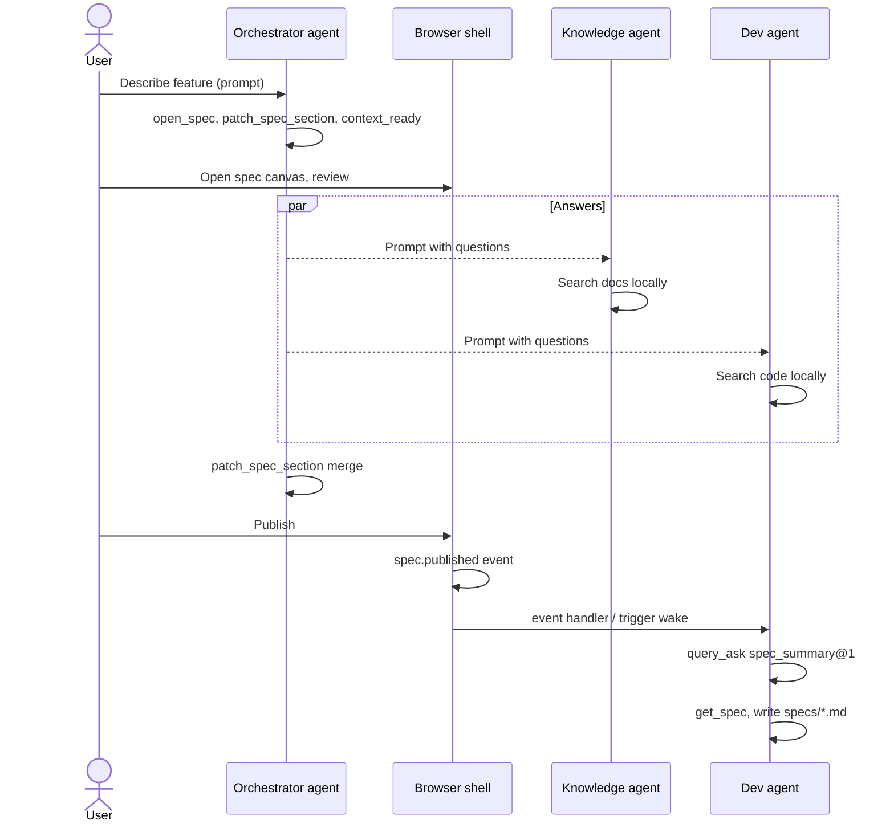

# Multi-agent feature spec (v2 indexed)

Three folders on your machine. Three agents in three IDEs. One feature spec that crosses all of them — with **your approval** before dev writes anything.

**Path:** indexed flows in `.mrmr/` + **`mrmr space apply`**. **Tutorial:** [Multi-agent brief](./tutorials/02-multi-agent-brief/). **Example:** [`team-brief-v2`](https://github.com/gael-boyenval/murrmure/tree/main/examples/flows/team-brief-v2).

**Desktop for humans (ViewCanvasHost at checkpoints). MCP for agents. CLI for admin.**

---

## What you are building

| Folder | Space | Agent | Role |
|--------|-------|-------|------|
| `~/work/orchestrator/` | `spc_orchestrator` | Orchestrator | Owns the spec; drafts and assembles |
| `~/work/knowledge-base/` | `spc_knowledge` | Knowledge | Answers from docs and ADRs |
| `~/work/dev-project/` | `spc_dev` | Dev | Answers from code; writes `specs/…` locally |

Flow:

1. You describe a feature to the **orchestrator** agent.
2. Orchestrator drafts a spec (`open_spec`, sections via MCP).
3. Orchestrator asks **Knowledge** and **Dev** (in parallel, via prompts + events).
4. Orchestrator assembles the spec and pauses for **your approval**.
5. You **Publish** in the spec canvas (or approve a gate).
6. **`spec.published`** wakes the **Dev** agent (when a trigger is registered).
7. **Dev** uses **`query_ask`** / **`get_spec`**, then writes `~/work/dev-project/specs/guest-checkout-v1.md`.

---

## Prerequisites

1. [Murrmure Desktop](./desktop) running with local hub
2. **CLI operator** — you run `mrmr space` / `mrmr grant mint`, not curl
3. On each agent machine: `npm install -g @murrmure/cli`
4. Three directories:

   ```
   ~/work/orchestrator/
   ~/work/knowledge-base/
   ~/work/dev-project/
   ```

---

## Part 1 — Admin setup (CLI)

Do this **once** as admin from a terminal while **Murrmure Desktop** is running. Use Desktop to observe spaces, sessions, gates, and trigger deliveries.

### 1.1 Create three spaces

```bash
mrmr login --hub-url http://127.0.0.1:8787

mrmr space create --slug orchestrator --name "Orchestrator" --install-policy authorized_agents
mrmr space create --slug knowledge --name "Knowledge" --install-policy authorized_agents
mrmr space create --slug dev --name "Dev" --install-policy authorized_agents
```

Record the space ids (`spc_orchestrator`, `spc_knowledge`, `spc_dev`) from command output or `mrmr space list`.

### 1.2 Index orchestrator flow

```bash
cd ~/work/orchestrator
mrmr space init
mrmr space flow init feature-spec --template hello-gate
# edit .mrmr/flows/, views/, space/handlers.yaml (event handler for spec.published)
mrmr space link --path . --space spc_orchestrator
mrmr space apply --strict
```

Mint grants with **`--capabilities flow:run,flow:read,query:ask`** so agents can invoke indexed actions and cross-space queries.

### 1.3 Mint agent grants

```bash
mrmr grant mint --space spc_orchestrator --label "Orchestrator Cursor" \
  --template worker --flow-acl feature-spec

mrmr grant mint --space spc_knowledge --label "Knowledge Cursor" --template worker

mrmr grant mint --space spc_dev --label "Dev Cursor" --template worker
```

Copy each **one-time token** immediately.

**Cross-space reads (recommended):** allow the Dev space to query the Orchestrator space:

```bash
mrmr space update spc_orchestrator \
  --query-policy '{"inbound_allowlist":["spc_dev"]}'
```

Dev agent uses MCP **`query_ask`** with `query_type: "spec_summary@1"` after publish (summary only — no `body_ref`).

Optional: mint read grants on Knowledge/Dev spaces for the orchestrator machine if it needs full section bodies via **`get_spec`**.

::: warning
Do **not** give the orchestrator write access to foreign spaces. Cross-space coordination uses **events**, **`query_ask`**, and optional read grants — not shared write tokens.
:::

### 1.4 Register trigger (Dev space)

```bash
mrmr space trigger register --space spc_dev \
  --template spec-published-wake-dev \
  --source-space spc_orchestrator
```

After you **Publish**, the trigger routes to a dev-space **event handler** (or legacy trigger template): the hub dispatches `spec.published` and the dev agent session receives work via handler `shell_spawn` / MCP wake. The dev space must index a handler for `spec.published` (or register `spec-published-wake-dev` trigger). Check delivery outcomes:

```bash
mrmr space trigger deliveries --space spc_dev --limit 20
```

Each row has terminal `outcome`: `success`, `failed`, or `deduped` (not `pending` / `resolved` / `delivered`).

---

## Part 2 — Connect each directory (MCP)

Open each folder in **its own Cursor window**. Create `.cursor/mcp.json`:

Install bridge once:

```bash
npm install -g @murrmure/mcp-bridge
```

Use the same thin config in each folder:

```json
{
  "mcpServers": {
    "murrmure": {
      "command": "murrmure-mcp",
      "env": {
        "MURRMURE_HUB_TOKEN": "${env:MURRMURE_HUB_TOKEN}"
      }
    }
  }
}
```

Then, in each agent shell/window, export the matching token for that space:

```bash
export MURRMURE_HUB_TOKEN=tok_ORCHESTRATOR_GRANT   # orchestrator window
export MURRMURE_HUB_TOKEN=tok_KNOWLEDGE_GRANT      # knowledge window
export MURRMURE_HUB_TOKEN=tok_DEV_GRANT            # dev window
```

Optional local pointer switch:

```bash
mrmr grant use --space spc_orchestrator
```

Repeat per space (`spc_knowledge`, `spc_dev`) on the machine that stores those grants.

Reload MCP in every window.

---

## Part 3 — Open Murrmure Desktop (human)

1. Launch **Murrmure Desktop** — bootstrap auth is automatic
2. Open the Orchestrator space and keep Desktop visible during the run
3. **Gates** — bookmark for later approvals (`/runs/:runId` or Desktop space home at `/spaces/:spaceId`)
4. **Sessions / runs** — open spec work from Desktop space home (`/spaces/:spaceId`), then follow session or run links (`/sessions/:sessionId`, `/runs/:runId`)

---

## Part 4 — Run the workflow

### 4.1 You → Orchestrator: describe the feature

In `~/work/orchestrator/`, prompt:

> We need guest checkout — users buy without an account. Open a feature spec titled "Guest checkout v1", draft goals and API sections, and list open questions for knowledge and dev.

The orchestrator agent should:

1. **`open_spec`** — returns `spec_key` (`ins_…`), state `gathering_context`
2. **`patch_spec_section`** — goals, API, open questions as sections
3. **`transition_spec`** with `context_ready` → state **`draft`**

You can verify in Desktop → Orchestrator space home → open the spec session.

### 4.2 Orchestrator → Knowledge

In `~/work/knowledge-base/`, prompt:

> The orchestrator is gathering context for guest checkout. Search `docs/` and ADRs for policy and payment constraints. Summarize answers the orchestrator can merge into the spec.

Knowledge agent uses local codebase tools, then reports back (orchestrator merges via further **`patch_spec_section`** calls in the orchestrator window).

### 4.3 Orchestrator → Dev

In `~/work/dev-project/`, prompt:

> Answer dev questions for guest checkout: where is CartService, does checkout require auth? Report paths and facts for the orchestrator to merge.

Same pattern — orchestrator merges into the spec via MCP.

### 4.4 You: publish in Desktop

1. Desktop → Orchestrator space → open the spec session
2. Read sections
3. Click **Publish** (when state is `draft` and config allows)

Or, if review is required: **Submit for review** → resolve the gate from **Gates** or `/runs/:runId` → publish path per install config.

Journal emits **`spec.published`** with `body_ref` and `published_by`.

### 4.5 Dev: wake, fetch, write the file

When the trigger or event handler is registered, the dev Cursor window is woken after you publish (replay on MCP reconnect if the session was offline). Prompt:

> You were woken for a published spec. Use **`query_ask`** with `target_space_id` set to the orchestrator space and `query_type: "spec_summary@1"`. If you need the full body, use **`get_spec`** with the `spec_key` from the wake payload. Write `specs/guest-checkout-v1.md` locally and commit.

Without a trigger, prompt manually when you see **`spec.published`** in Desktop **`/logs`**, or after the orchestrator notifies you.

Dev agent flow:

1. **`query_ask`** — cross-space summary (no `body_ref`)
2. **`get_spec`** — optional full spec when a read grant on the orchestrator space exists
3. Write the file locally, commit in git

---

## Sequence diagram



---

## Observability

| What | Where |
|------|--------|
| Spec draft / publish | Desktop → space home → spec session |
| Pending gate | Desktop → **Gates** or `/runs/:runId` |
| Trigger deliveries | `mrmr space trigger deliveries --space spc_dev` |
| Event journal | Desktop **`/logs`** (or `mrmr runtime audit export`) |
| Agent-side tail | MCP handshake wake messages — optional CLI |

---

## Common mistakes

| Mistake | Fix |
|---------|-----|
| One token in all three IDEs | Use three grants (one token per agent window) |
| MCP tools missing | **`mrmr space apply --strict`**; **`mrmr grant mint`** with `flow:run` / `query:ask`; reload MCP |
| Orchestrator writes into dev repo | Dev agent writes locally after publish |
| Skipping human publish | Agent reaches `draft`; you **Publish** in spec canvas |
| Wrong space context | Export the token minted for that space (or run `mrmr grant use --space ...`) |
| Dev not woken after publish | Register **Spec published → wake dev** trigger; check `mrmr space trigger deliveries` |
| `query_ask` returns `QUERY_POLICY_DENIED` | Add dev space id to orchestrator `query_policy.inbound_allowlist` |
| Need full spec cross-space | Mint read grant on orchestrator space for dev agent, then **`get_spec`** |

---

## What is not in the shell yet

- **`query_policy` editor** — set `inbound_allowlist` via `mrmr space update --query-policy` until a UI ships
- **Section editing in spec canvas** — agents edit via MCP; humans publish, approve, and revise
- **Custom trigger builder** — use templates, `mrmr space trigger register`, or raw API; no visual filter editor yet

These do not require curl for normal agent work — MCP and CLI trigger templates cover the multi-agent spec path.

---

## Related

- [Murrmure Desktop](./desktop)
- [Connect your agent](./agents-mcp)
- [MCP tools reference](../reference/mcp-tools)
- [Review workflow](./review-workflow)
