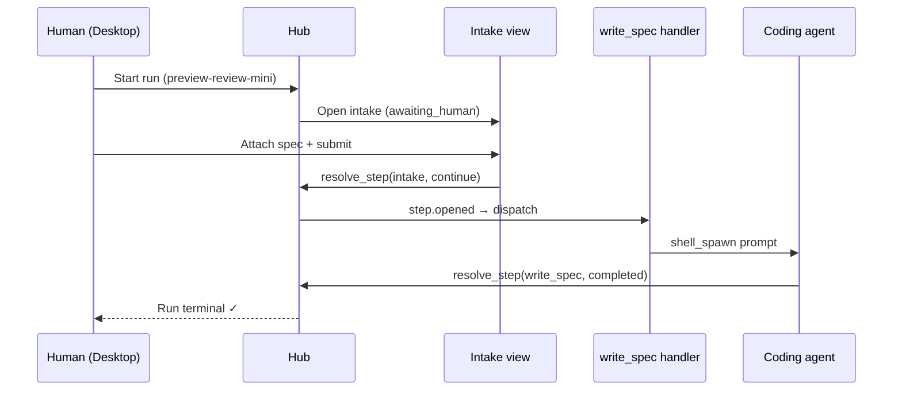

# Tutorial 1 (v3) — Your first flow in three beats

Learn Murrmure by **watching one simple workflow evolve** — not by building every layer at once.

You will launch Desktop, create a **space**, write a **two-step flow** (human intake → agent writes spec), run it once, and understand what the hub does at each pause.

The full preview-review loop (build, live review, archive, commit) lives in the **[original 9-part tutorial](../01-local-preview-review/)** — use it after this one.

## How this tutorial is different

| | **This tutorial (v3)** | **Full tutorial (v1)** |
|---|------------------------|------------------------|
| **Goal** | Understand Murrmure's moving parts | Ship a production-style workflow |
| **Structure** | One concept per beat, start → finish | Layer by layer (handlers, views, manifest, …) |
| **Flow** | `intake` → `write_spec` (2 steps) | `intake` → `write_spec` → `build` → `archive` → `commit` |
| **Parts** | 3 | 9 |

## What you will learn

| Beat | Concept | You see it when… |
|------|---------|----------------|
| **1** | Hub, Desktop, space | You launch the app and run `mrmr setup` |
| **2** | Flow vs handler vs view | You write a minimal manifest + one handler + one view |
| **3** | Runs, journal, handoffs | You click **Run** and trace intake → agent → done |

## Story in one line

```text
Human attaches spec file → agent copies it into the repo → run completes
```



## Pages (follow in order)

1. [Launch Desktop and create your space](./01-launch-and-create-space)
2. [Build a minimal two-step flow](./02-build-minimal-flow)
3. [Run it and read what Murrmure did](./03-run-and-understand)

## Prerequisites

- Node.js 20+
- Murrmure Desktop (or hub at `http://127.0.0.1:8787`)
- A **coding agent with MCP support** (Cursor, Claude Code, or any tool that can run `murrmure-mcp`) — needed when the agent step runs in Part 3

## After this tutorial

- **[Tutorial 1 — Full walkthrough](../01-local-preview-review/)** — nested build/review loop, archive, commit
- [How it fits together](../../how-it-fits-together) — architecture map
- [Space handlers](../../space-handlers) — handler reference

## Next

[Part 1 — Launch Desktop and create your space →](./01-launch-and-create-space)
