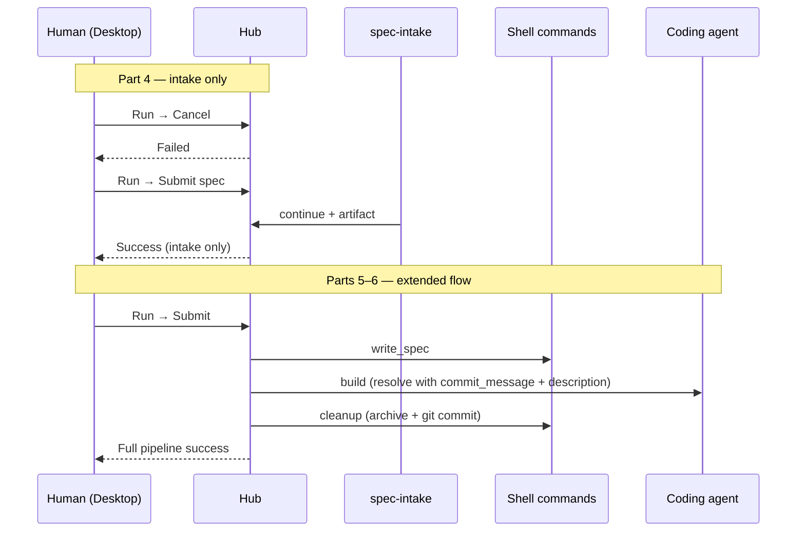

# Tutorial 1 (v3) — Your first flow in six beats

Learn Murrmure by **watching one simple workflow evolve** — not by building every layer at once.

You will launch Desktop, create a **space**, write a flow, build a **custom view**, run intake from the app, then extend the graph with command and agent handlers.

The full preview-review loop (nested build/review, archive) lives in the **[original 9-part tutorial](../01-local-preview-review/)** — use it after this one.

## How this tutorial is different

| | **This tutorial (v3)** | **Full tutorial (v1)** |
|---|------------------------|------------------------|
| **Goal** | Understand Murrmure's moving parts | Ship a production-style workflow |
| **Structure** | One concept per beat, start → finish | Layer by layer (handlers, views, manifest, …) |
| **Flow** | `intake` → `write_spec` → `build` → `cleanup` (flat, no review) | Same graph + nested build/review + archive |
| **Parts** | 6 | 9 |

## What you will learn

| Beat | Concept | You see it when… |
|------|---------|----------------|
| **1** | Hub, Desktop, space | You launch the app and run `mrmr setup` |
| **2** | Flow manifest | You write `my-dev-flow` — intake with explicit branches; linear steps need only `id` + `description` |
| **3** | Custom view | You build **spec-intake** — file picker + Submit/Cancel |
| **4** | Runs, journal | Cancel fails; Submit succeeds; artifact on disk |
| **5** | Handlers — copy + build | Shell copy handler; agent build with commit payload |
| **6** | Cleanup | Archive spec + `git commit` from build output |

## Story in one line

```text
Cancel → failed · Submit spec → success · write → build (payload) → cleanup (archive + commit)
```



## Pages (follow in order)

1. [Launch Desktop and create your space](./01-launch-and-create-space)
2. [Build the flow manifest](./02-build-minimal-flow)
3. [Build the intake view](./03-build-intake-view)
4. [Run it and read what Murrmure did](./04-run-and-understand)
5. [Copy the spec and build](./05-extend-flow-and-handlers)
6. [Cleanup and commit](./06-cleanup-and-commit)

## Prerequisites

- Node.js 20+
- Murrmure Desktop (or hub at `http://127.0.0.1:8787`)
- A coding agent with MCP (for **`build`** in Part 5) — connected during `mrmr setup`
- Git configured in your space repo (for **`cleanup`** in Part 6)

## After this tutorial

- **[Tutorial 1 — Full walkthrough](../01-local-preview-review/)** — nested build/review loop, archive, richer handlers
- [How it fits together](../../how-it-fits-together) — architecture map
- [Space handlers](../../space-handlers) — handler reference

## Next

[Part 1 — Launch Desktop and create your space →](./01-launch-and-create-space)
