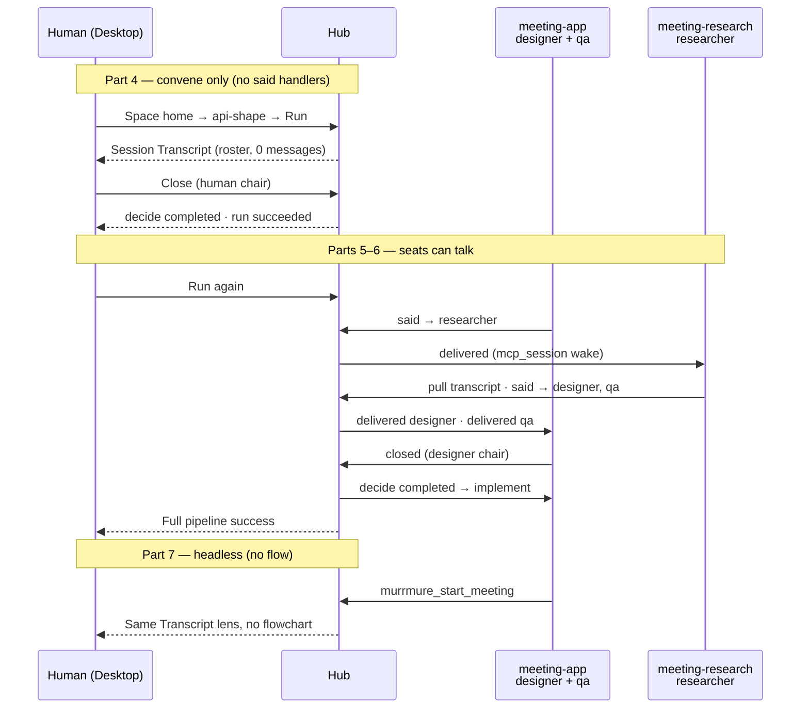

# Tutorial 1b — A meeting in seven beats

You already finished [Tutorial 1a](../01-local-preview-review-v3/). This tutorial is the **next path**, not the first. You will put two voices in one space and a third voice in another space into **one session**, read the chat in Desktop (not a View), and let a chair close the room.

Index label **1b**. Folder **`02-meetings/`** so it does not collide with the retired v2 tutorial that was also called “1b.”

## How this tutorial is different

| | **1a (required first)** | **This tutorial (1b)** |
|---|-------------------------|------------------------|
| **Goal** | One space, one flow, one View, one agent step | Two spaces, one room, shell Transcript |
| **Human UI** | Custom intake View | No View. Transcript + Close |
| **Start** | **Run** on `my-dev-flow` | **Run** on `api-shape` (headless only in Part 7) |
| **Parts** | 6 | 7 |

## What you will learn

| Beat | Concept | You see it when… |
|------|---------|----------------|
| **1** | One hub, two spaces | Sidebar lists `meeting-app` and `meeting-research` |
| **2** | Personas are ads | `murrmure_list_personas` returns blurbs only |
| **3** | `meeting:` facet | Space home shows `api-shape` — no View |
| **4** | Session is the room | **Run** → Transcript, 3 seats, 0 messages; human **Close** |
| **5** | Seats wake on `said` | Designer speaks; researcher replies; later turns reuse the live assignment |
| **6** | Close advances the flow | Designer `closed` → `implement` writes `docs/api-shape.md` |
| **7** | Headless convene | Same room without a flowchart; then commit |

## Story in one line

```text
Run api-shape → empty room (3 seats) → human Close
  · then designer said → researcher · researcher replies (+ qa)
  · designer Close → implement writes the outcome
  · then the same room shape without a flow (headless)
```



## Pages (follow in order)

1. [Two spaces on one hub](./01-two-spaces)
2. [Advertise seats](./02-personas)
3. [A step that is a room](./03-meeting-flow)
4. [Run it and read the room](./04-run-and-read-the-room)
5. [Wake a seat](./05-wake-seats)
6. [Close the room so the flow can continue](./06-talk-and-advance)
7. [Same room, no flow — then commit](./07-headless-and-cleanup)

## Prerequisites

- [Tutorial 1a](../01-local-preview-review-v3/) Parts 1–6 finished (or equivalent: Desktop, `mrmr setup`, apply, Run, handlers, `murrmure_space_status`)
- Node.js 20+, Murrmure Desktop (hub `http://127.0.0.1:8787`), `@murrmure/cli`
- Git in both new repos (Part 7)
- **Two** MCP connections — one per new space — each installed in a tool context that can stay open for Parts 5–7
- Ability to grant **`event:emit`** and **`journal:read`** on both (Part 5). Part 1 stays `local-tools/v1`

Not required: `~/work/my-first-space`, a second Desktop, `mrmr space view init`, `events.yaml`, federation, or `query_ask`.

## After this tutorial

- [Meetings](../../meetings) — conceptual home
- [Space handlers](../../space-handlers) — `on.event.participant`
- [Shell UI routes](../../shell-routes) — `/sessions/:id` Transcript

Do **not** follow the archived v2 “1b” tutorial. Do **not** go back to 1a to add a meeting View.

## Next

[Part 1 — Two spaces on one hub →](./01-two-spaces)
