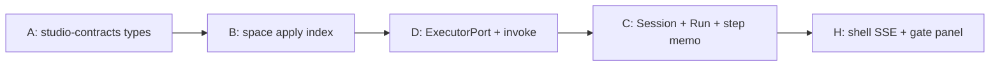

# Space–Flow–Protocol v2 — Architecture Path

**Status:** draft — architecture guide for implementing rev-1  
**Date:** 2026-06-30 (resolutions merged into rev-1 §16b 2026-06-30)  
**Origin:** Three high-thinking agent reviews (protocol/core, shell/UI, extensibility/federation) against [space-flow-protocol-v2.spec-rev-1.md](./space-flow-protocol-v2.spec-rev-1.md), [philosophy.md](../../current/product/philosophy.md), current packages, and `.opensrc` references (Open Design, A2A, Temporal, Inngest, CloudEvents, Windmill, MCP SDK)  
**Normative product spec:** rev-1 supersedes unresolved v2 draft items; philosophy wins on intent conflicts. **Plan execution:** v2 core shipped — active backlog at [plan/index.md](./plan/index.md).

> **Purpose:** Define a clean, evolvable package and layer structure to build rev-1. Package renames and splits are allowed. Prefer elegant simplicity — extract packages only when a boundary earns its cost.

---

## 0. Executive summary

rev-1 is an **evolution within the existing two-ring hexagon**, not a greenfield rewrite.

| Ring | Role today | rev-1 change |
|------|------------|--------------|
| **Generic kernel** (`runtime-*`) | Event-sourced aggregate, checkpoint, reactions, journal fold | Minimal — Run = aggregate, Gate = checkpoint, Hook = reaction |
| **Murrmure protocol** (`studio-*`) | Spaces, instances, flow installs, triggers, MCP | **Rename** Instance→Run; **add** Session correlation, ExecutorPort + preflight, CloudEvents journal, space directory index |
| **Edges** (daemon, cli, shell, executors) | HTTP/SSE/MCP + fat worker/mount runtime | **Shrink daemon** to transport + adapters; **demote** flow-install worker UI to deferred slice F |

**Spec principle (unchanged):**

> Flows declare work; sessions track it; runs execute it; views project it; logs record it.

**Architecture principle:**

> Protocol kernel stays pure and I/O-free. Murrmure semantics live in `studio-hub-core` behind ports. Environment-specific behavior (SQLite, shell spawn, SSE, federation wire) lives in adapters. The shell observes; CLI mutates.

---

## 1. Layer model

```text
┌─────────────────────────────────────────────────────────────────┐
│  EDGES — observe / mutate / deliver                             │
│  shell-web · shell-ui · shell-client · cli · hub-daemon ·       │
│  studio-executors (mcp · shell · queue · remote) · desktop      │
└────────────────────────────┬────────────────────────────────────┘
                             │ HTTP / SSE / MCP / fs
┌────────────────────────────▼────────────────────────────────────┐
│  MURRMURE PROTOCOL — studio-hub-core                            │
│  session · flow-engine · space-index · invoke · grants ·        │
│  step-memo projections · federation policy                      │
└────────────────────────────┬────────────────────────────────────┘
                             │ CommandPort / QueryPort / ports
┌────────────────────────────▼────────────────────────────────────┐
│  GENERIC KERNEL — runtime-kernel                                │
│  aggregate(Run) · checkpoint(Gate) · reaction(Hook) · journal   │
│  waiters · fanout · projections logic                           │
└────────────────────────────┬────────────────────────────────────┘
                             │ PersistencePort
┌────────────────────────────▼────────────────────────────────────┐
│  PERSISTENCE — runtime-persistence · studio-hub-persistence     │
└─────────────────────────────────────────────────────────────────┘

OUTSIDE HUB (never stored):
  View = client reading /v1/sessions, /v1/runs, journal SSE
  Agent = harness × task × context × space
  Space content = user directory (agent.md, skills, src/)
```

### 1.1 Responsibility matrix

| Layer | Owns | Must never |
|-------|------|------------|
| **Protocol kernel** | Run lifecycle, gate interrupt, hook dedup/delivery, journal append, idempotency | Prompts, flow graphs, UI, executor implementation |
| **Flow engine** | Step graph validation, matrix→sibling-run planning, start conditions, pinned `flow_digest` execution | Business logic, agent config, view rendering |
| **Space index** | Parse/index `murrmure/` files: actions, executors, hooks, flows | Own agent content; interpret param semantics |
| **Session correlation** | Grouping, `subject` path, derived status from child runs | Step state machines (Runs own those) |
| **Executor adapters** | Preflight reachability, dispatch, completion reporting | LLM loops; silent queue-without-visibility |
| **Shell** | Flowchart, gates, notifications, logs explorer, CLI instruction pages | Author graphs; `space init` wizards; agent definitions |
| **CLI** | `space link/apply`, `flow push`, grant mint, headless invoke | Replace hub enforcement |

**Decision test (every PR):** *Is this protocol, flow, view rule, or space implementation?* Only the matching layer may own it.

---

## 2. Target package graph

### 2.1 Dependency direction

```text
@murrmure/runtime-contracts          ← leaf: ports, types, journal fold
       ↑
@murrmure/runtime-kernel             ← pure domain (no I/O)
       ↑
@murrmure/runtime-persistence        ← memory + SQLite (+ bun:sqlite adapter)
       ↑
@murrmure/studio-contracts           ← rev-1 wire Zod (Session, Run, CE journal, …)
       ↑
@murrmure/studio-hub-core            ← Murrmure domain + flow-engine module + space-index
       ↑
@murrmure/studio-hub-persistence
       ↑
@murrmure/studio-hub-daemon          ← thin: HTTP/SSE/MCP routes + composition root

Adapters & products (depend on core/client, not each other):
  @murrmure/studio-executors         ← ExecutorPort implementations
  @murrmure/hub-client               ← typed fetch + SSE (rename from studio-hub-client)
  @murrmure/cli                      ← mrmr CLI + MCP
  @murrmure/shell-client             ← rev-1 API surface for shell (extract from hub-client)
  @murrmure/shell-ui                 ← shadcn/ui + Tailwind + dark theme tokens
  @murrmure/shell-web                ← SPA routes + built-in views
  @murrmure/flow-kit                 ← manifest schema, validate, digest (rename flow-dev-kit)
  @murrmure/view-sdk                 ← optional custom view host (slice F, deferred)
  @murrmure/desktop                  ← Electrobun host; Bun sidecar
```

**CI boundary gate (extend existing `check:boundaries`):**

- `runtime-kernel` imports only `runtime-contracts`
- `studio-hub-core` imports `studio-contracts` + `runtime-*` — **never** `better-sqlite3`, `node:fs`, `hono`
- `studio-hub-daemon` is composition + routes only — domain logic moves up to core

### 2.2 Changes from current packages

| Action | From | To | Rationale |
|--------|------|-----|-----------|
| **Rename publish id** | `@murrmure/contracts` | `@murrmure/studio-contracts` | Disambiguate from `runtime-contracts` |
| **Rename publish id** | `@murrmure/hub-client` | keep id; dir already `studio-hub-client` | Add rev-1 session/run/journal methods |
| **Rename / shrink** | `@murrmure/flow-dev-kit` | `@murrmure/flow-kit` | Flow = manifest only; demote react/host/worker to `view-sdk` |
| **Extract** | daemon domain files | `studio-hub-core/*` | cross-space, trigger-dispatcher, mount logic |
| **Extract** | new package or `core/executors` | `@murrmure/studio-executors` | mcp_session, shell_spawn, queue_poll, remote_hub |
| **Demote (slice F)** | daemon worker pools, mount-registry, bundle-ingest | `@murrmure/view-sdk` + optional `studio-view-host` | v1 per-space install + bundled UI is not rev-1 protocol |
| **Merge / delete** | `@murrmure/runtime-daemon` | fold into `runtime-adapter-http` | One kernel adapter, not two daemons |
| **Fold** | `@murrmure/triggers-templates` | `cli/templates` | Hooks are space files, not a workspace package |
| **New module** | — | `studio-hub-core/flow-engine/` | Step graph semantics; extract to `@murrmure/flow-engine` only if module exceeds ~2k LOC |

**Net:** ~14 packages → ~13, with clearer rings. No big-bang rename of directory names (`studio-*` → `murrmure-*`) until a dedicated hygiene slice — published npm names matter more than folder names.

### 2.3 Entity → module map

| rev-1 entity | Kernel primitive | Module |
|--------------|------------------|--------|
| **Session** | *(studio only)* | [`studio-contracts/src/entities/session.ts`](../../../../packages/studio-contracts/src/entities/session.ts) |
| **Run** | `aggregate` | [`studio-contracts/src/entities/run.ts`](../../../../packages/studio-contracts/src/entities/run.ts) (alias `Instance` via [`instance.ts`](../../../../packages/studio-contracts/src/entities/instance.ts)) |
| **Gate** | `checkpoint` | `runtime-kernel/checkpoint/` + [`studio-contracts/src/entities/gate.ts`](../../../../packages/studio-contracts/src/entities/gate.ts) |
| **Hook** | `reaction-spec` | `runtime-kernel/reactions/` + [`studio-contracts/src/entities/hook.ts`](../../../../packages/studio-contracts/src/entities/hook.ts) |
| **Action / Executor** | via `ActionPort` + `ExecutorPort` | [`studio-contracts/src/entities/action.ts`](../../../../packages/studio-contracts/src/entities/action.ts), [`executor.ts`](../../../../packages/studio-contracts/src/entities/executor.ts) + `studio-hub-core/index/` + `studio-executors/` |
| **Flow** | flow-engine input | [`studio-contracts/src/flow/manifest.ts`](../../../../packages/studio-contracts/src/flow/manifest.ts), [`flow-index.ts`](../../../../packages/studio-contracts/src/entities/flow-index.ts) + `studio-hub-core/flow-engine/` |
| **Journal** | `journal-entry` + fold | [`studio-contracts/src/journal/cloudevents.ts`](../../../../packages/studio-contracts/src/journal/cloudevents.ts) |
| **RunStepMemo** | projection | [`studio-contracts/src/entities/run-step-memo.ts`](../../../../packages/studio-contracts/src/entities/run-step-memo.ts) + `studio-hub-core/projections/step-memo.ts` |
| **Artifact** | `BlobPort` | [`studio-contracts/src/entities/artifact.ts`](../../../../packages/studio-contracts/src/entities/artifact.ts) + exchange store |
| **Grant** | `PolicyPort` | [`studio-contracts/src/grants/capability.ts`](../../../../packages/studio-contracts/src/grants/capability.ts) + core grant store |
| **View** | *(not stored)* | shell built-ins + optional `view-sdk` packages |

**Key insight:** Session is the only genuinely new hub entity. Run, Gate, and Hook already exist as kernel primitives under different names — rev-1 is mostly **vocabulary alignment + correlation layer**, not a new execution engine.

---

## 3. Core ports and testing boundaries

### 3.1 Port surface

| Port | Location | Mock in tests | Real adapter |
|------|----------|---------------|--------------|
| `PersistencePort` | [`runtime-contracts`](../../../../packages/runtime-contracts/src/ports/persistence-port.ts) | in-memory | SQLite / `bun:sqlite` |
| `ActionPort` *(new)* | [`runtime-contracts/src/ports/action-port.ts`](../../../../packages/runtime-contracts/src/ports/action-port.ts) | fixture index | `studio-hub-core/index/` |
| `ExecutorPort` *(new)* | [`runtime-contracts/src/ports/executor-port.ts`](../../../../packages/runtime-contracts/src/ports/executor-port.ts) | scripted reachable/unreachable | `studio-executors/*` |
| `ReactionActionPort` | [`runtime-contracts/src/ports/reaction-action-port.ts`](../../../../packages/runtime-contracts/src/ports/reaction-action-port.ts) | recording stub | kernel fanout |
| `CommandPort` / `QueryPort` | `runtime-contracts` | handler with fakes | hub-core |
| `PolicyPort` | studio | grant table | grant store |
| `NotifyPort` | runtime | capture buffer | SSE multiplex |
| `BlobPort` | runtime | in-memory map | exchange store |
| `FlowEnginePort` | studio | golden graph fixtures | `flow-engine` module |
| `FederationPort` | studio | stub relay | daemon wire (slice I) |

**Composition rule (phase 01 boundary CI):** `studio-hub-core` imports ports and pure logic only — **never** `studio-hub-persistence`, `node:fs`, or HTTP frameworks. Daemon is the composition root injecting `PersistencePort` implementations.

### 3.2 ActionPort (indexed action lookup)

Read-only resolution of indexed actions — not invoke dispatch:

```typescript
interface ActionPort {
  resolve(spaceId: string, actionName: string): Promise<IndexedAction | null>;
  list(spaceId: string): Promise<IndexedAction[]>;
}
```

Invoke orchestration lives in hub-core invoke module; dispatch goes through `ExecutorPort`.

**Rationale for studio-shaped ports in `runtime-contracts`:** Murrmure is the primary consumer today; keeping invoke/index ports in the leaf package avoids a premature `@murrmure/studio-runtime-contracts` split. If a second protocol consumer appears, extract then — not before phase 16.

### 3.3 ExecutorPort (critical new boundary)

Every invoke must pass preflight before `mrmr.action.dispatched`:

```typescript
interface ExecutorPort {
  preflight(binding: ExecutorBinding): Promise<Reachability>;
  dispatch(invoke: InvokeRequest): Promise<DispatchOutcome>;
  cancel?(invoke: InvokeRequest): Promise<void>;  // session cascade — see open Q3
}
```

Replaces v1 silent `mcp.wake_pending`. Unreachable → `EXECUTOR_UNAVAILABLE` on run graph within timeout.

### 3.4 Conformance suites

| Suite | Location | Pass criteria |
|-------|----------|-------------|
| Persistence | `runtime-persistence/conformance/` *(exists)* | Same command stream → identical journal + snapshot across adapters |
| Executor | `studio-executors/conformance/` *(new)* | Sync/async/timeout/unavailable/idempotent re-dispatch |
| CloudEvents | `studio-contracts/conformance/` *(new)* | Every journal fixture validates CE required attrs + `subject` |
| Flow engine | `studio-hub-core/flow-engine/conformance/` *(new)* | Matrix expansion, gate steps, invalid graph rejection at index time |

### 3.5 Test placement

| Layer | Where | What |
|-------|-------|------|
| Property | `runtime-kernel/test/property/` | fold equivalence, idempotency, dedup, gate pre-commit |
| Property | `studio-hub-core/test/property/` | session status derivation (pure fn), step-memo overlay |
| Unit | `studio-hub-core/test/unit/` | flow matrix planning, ACL redaction, preflight branches |
| Integration | `studio-hub-persistence/test/integration/` | crash/WAL, concurrent CAS |
| HTTP fixtures | `studio-hub-daemon/test/http/` | golden denial sequences, v1 J01 shims |
| Shell | `shell-web/**/*.test.tsx` + MSW | view components against typed client mocks |
| E2E | deferred | desktop bundled + CLI link → shell lists space (slice H) |

**Rule:** No review-loop journey tests in kernel. Domain scenarios live at daemon fixture or E2E level.

---

## 4. Flow engine and space index

### 4.1 Flow engine (thin orchestrator)

**Placement:** `studio-hub-core/flow-engine/` module behind `FlowEnginePort`. Extract to `@murrmure/flow-engine` package only when complexity justifies the publish boundary.

**Owns:**

- Parse + validate `flow.manifest.yaml` at index time (not per-run)
- Compile to canonical IR; store `flow_digest` on Run start
- Step types: `invoke`, `parallel.matrix`, `gate`, `wait` (event/journal), reserved `start_flow`
- Plan sibling Runs for matrix branches
- Advance run step memo from journal events (via projection, not inline in HTTP handlers)

**Does not own:** ACL checks (core), executor dispatch (ExecutorPort), UI projection (shell).

**Reference borrow:** Temporal workflow/activity separation; Inngest step memoization; GHA matrix + start conditions — **reject** in-hub workflow code execution (Windmill/Temporal anti-pattern for Murrmure).

### 4.2 Space directory index

**Pipeline:** `mrmr space link` → `mrmr space apply` → hub index refresh (digest diff, partial update)

**Indexed files:**

```text
murrmure/
  space.yaml          # optional metadata
  actions.yaml
  executors.yaml      # optional if inline in actions
  hooks.yaml          # triggers.yaml alias during migration
  flows/
    {name}/flow.manifest.yaml
  views/              # optional client packages — hub does NOT register
```

**CLI evolution:** Add first-class `space apply/status`; keep `space trigger` as compatibility shim → hooks.

### 4.3 Hook vs flow start (strict split)

| Concept | File | Question answered |
|---------|------|-------------------|
| **Hook** | `hooks.yaml` | When does this **space** react to an event? |
| **Flow start** | `flow.manifest.yaml` `start:` | How may this **flow** be started? |

**Hook delivery invariant:** Always create Session (if needed) + Run + journal `mrmr.hook.delivered`. No silent executions.

---

## 5. Shell and UI architecture

### 5.1 Package split

| Package | Owns |
|---------|------|
| `@murrmure/shell-client` | Typed rev-1 client: sessions, runs, gates, journal SSE, notifications. Extract from hub-client — shell should not import configure/flow-install APIs. |
| `@murrmure/shell-ui` | shadcn/ui components, Tailwind config, dark theme CSS variables, layout primitives (sidebar, header, split-pane, badge) |
| `@murrmure/shell-web` | Routes, page composition, built-in views, React Query/SWR hooks |
| `@murrmure/view-sdk` *(slice F)* | Optional iframe/host protocol for custom views (review panel, kanban) |

**No hub view registry.** Views are clients that read protocol APIs. Authors may ship view packages in `murrmure/views/`; shell discovers via space file references or `requires_view` URL, not hub DB rows.

### 5.2 UI stack

| Choice | Decision |
|--------|----------|
| Framework | React 18 + Vite (keep) |
| Routing | React Router v6 (keep) |
| Styling | Tailwind CSS v4 + CSS variables |
| Components | **shadcn/ui** (Radix primitives, copy-into-repo) |
| Aesthetic | Vercel-inspired: dark default, generous whitespace, subtle borders, monospace for ids/logs |
| Icons | Lucide |
| Data fetching | TanStack Query + SSE invalidation |
| Flowchart | **@xyflow/react** (React Flow) for parallel lanes; stepped-list fallback for headless/journal-only runs |
| Forms (gate) | shadcn Form + Zod from `GateFormSchema` |

**Retire from current shell-web (~40%):** Configure mode toggle, setup wizard, flow install wizards, per-space 5s polling, canvas-resolve mount registry, inline unstyled forms.

### 5.3 Built-in views (components, not micro-frontends)

| View | Component | Data source |
|------|-----------|-------------|
| **Flowchart** | `RunFlowchartView` | `GET /v1/runs/{id}/graph` (manifest overlay + step memo) |
| **Journal replay** | `JournalWaterfallView` | Fallback when no `flow_id`; Inngest-style waterfall |
| **Gate panel** | `GateResolvePanel` | `GET /v1/runs/{id}/gates`; auto-focus from notification deep link |
| **Logs explorer** | `LogsExplorerPage` | `GET /v1/journal?…` with filters |
| **Space home** | `SpaceHomePage` | rev-1 sections: Needs attention, Active runs, Your flows, Available to run, Receiving from, Recent |

**`requires_view` flow start:** Shell opens registered view URL (from space `murrmure/views/` manifest or bundled default) in a drawer/modal for param collection → POST run create with collected input. No hub-stored view entity — only a view id string on flow manifest resolved at runtime from space files.

### 5.4 Real-time model

Replace per-space polling with **one global journal SSE subscription**:

```text
JournalProvider (shell root)
  └─ EventSource /v1/journal/subscribe?… (filtered by actor grants)
       ├─ invalidate sessions / runs / gates queries
       ├─ update Needs you badge count
       └─ space sidebar badges (gates filtered per space)
```

**Notifications:** Persist in hub until dismissed/resolved. Gate assignees primary; fallback to `gate:resolve` holders. Separate from logs.

### 5.5 Navigation (rev-1)

```text
Top: [Landing] [Needs you (n)] [Logs] [⌘K] [Profile]

Sidebar — Spaces only (+ badge per space):
  ● landing-space
  ○ frontend (2)
  [ + ] → /spaces/new (CLI instructions)

Sessions via: notification → /sessions/:id · /sessions list · space home · ⌘K
```

### 5.6 Desktop vs web

| Concern | Desktop (bundled) | Web (hosted) |
|---------|-------------------|--------------|
| API base | `window.location.origin` via `isBundledShell()` | User-configured hub URL + token |
| Auth | Local bootstrap token | OAuth/session (future); Bearer token v1 |
| SSE | Same-origin, no CORS | Requires hub CORS + credentials policy |
| Bundle | `build:bundled` → Electrobun Resources | Static deploy to CDN or hub static route |
| Shared code | `@murrmure/shell-client` + `@murrmure/shell-ui` + `@murrmure/shell-web` identical | same |

### 5.7 CLI-first mutation UX

| Route | Content |
|-------|---------|
| `/spaces/new` | Copy-paste `mrmr space init`, `mrmr space link`; live SSE "Waiting for space…" |
| Space home empty | `mrmr flow init`, `mrmr flow push` instructions + link to bundled quick-start |
| No configure wizards | Deprecated routes redirect to instruction pages |

---

## 6. Cloud, federation, and multi-system readiness

### 6.1 Design rules

| Capability | Enabled by | Rule |
|------------|------------|------|
| Remote hub | Opaque `session_id` / `run_id`; CE `subject` path | Never path-as-id |
| Remote executor | `ExecutorPort` adapter `remote_hub` | Flow engine invokes port; cannot distinguish local vs remote |
| Remote space | Binding type `remote_hub` on space | Virtual space; actions require explicit remote executor |
| Cross-hub artifacts | Descriptor-first (`transfer_id`, digest, ACL) | Bytes via exchange store materialization — no raw blob relay in XS0 |
| Federation wire | `FederationPort` in core; relay in daemon | ADR-11/12: federation in core, relay = wire only |

**Move up from daemon today:** `cross-space-query`, trigger dispatch — federation logic must not live in transport layer.

### 6.2 Slice I placement (last)

Dependencies: invoke spine (D) + session/run (C). Federation adds:

- `remote_hub` executor adapter
- Virtual space bindings
- Cross-hub journal ingress with dedup
- Optional `a2a` executor (never core protocol)

Cross-space XS0 (`query_ask`) evolves toward action invoke; keep shims one release.

---

## 7. Desktop / web / Bun compatibility

| Package | Runtime target |
|---------|----------------|
| `runtime-contracts`, `runtime-kernel`, `studio-contracts`, `shell-client`, `flow-kit/validate` | Isomorphic (browser + Node + Bun) |
| `runtime-persistence`, `studio-hub-persistence` | Node/Bun server only |
| `studio-hub-daemon`, `studio-executors`, `cli` | Node/Bun server |
| `shell-web`, `shell-ui` | Browser (+ Electron webview) |

**Bun strategy:** Desktop bundles Bun. Add `runtime-persistence/bun-sqlite/` implementing `PersistencePort` via `bun:sqlite`. Select adapter at daemon composition root. Run existing persistence conformance suite — no kernel changes.

**Static import gates** keep core isomorphic and testable without native modules.

---

## 8. Migration slices → code map

Order: **A → B → D → C → H → E → G → F → I** (invoke is the spine)

| Slice | Primary packages | Build vs rename |
|-------|------------------|-----------------|
| **A** — Types | `studio-contracts` | **Build** Session, RunStepMemo, CE JournalEntry, Action, Executor, Artifact v1. **Alias** Instance→Run, HubEvent→JournalEntry |
| **B** — Space index | `studio-hub-core/index`, `cli`, daemon route | **Build** `space apply` indexer. **Alias** triggers→hooks |
| **D** — Invoke + artifacts | `studio-executors`, core invoke, exchange store | **Build** ExecutorPort, preflight, `.mrmr.temp/`. **Retire** silent mcp wake default |
| **C** — Session + Run | `studio-hub-core/session`, projections | **Build** Session correlation, step memo, journal replay query. **Rename** Run = aggregate |
| **H** — Notifications + logs | shell-web, core projections, daemon SSE | **Build** Needs you, `/notifications`, global SSE. **Replace** polling |
| **E** — Flow index + start | `flow-engine`, shell space home | **Build** manifest parser, start conditions, matrix runs |
| **G** — MCP orchestration gate | daemon MCP, core | **Build** attach + validate gate with graph preview |
| **F** — Custom views | `view-sdk`, optional view-host | **Demote** v1 worker/mount runtime here |
| **I** — Federation | `studio-executors`, federation port | **Build** remote_hub adapter |

**v1 shims (one release):** `instance_id` = `run_id`; `mcp_wake` → action invoke; dual-emit checkpoint → gate events.

---

## 9. Reference repo borrow / reject

| Repo | Borrow | Reject |
|------|--------|--------|
| **Open Design** | Hexagonal package split, contracts leaf, export pattern | Full OD product scope |
| **A2A** | contextId/Task → Session/Run; task immutability; parallel tasks | Agent Cards as core; SendMessage-primary |
| **Temporal** | Workflow/Activity → Flow/Action; worker poll → Executor; describe document | Workflow code in hub; deterministic code replay |
| **Inngest** | Step memoization; journal replay waterfall; every run visible | Full step runtime in hub |
| **CloudEvents** | Envelope + `subject` correlation; source+id dedup | — |
| **Windmill** | Split-pane run view; Gantt lanes; restart-from-step UX | In-platform editor as product center |
| **GHA** | Start conditions; matrix parallel; workflow_call reserved | — |
| **MCP SDK** | Tool patterns for CLI/MCP adapter | MCP as only client |

---

## 10. Anti-patterns (guardrails)

| Anti-pattern | Guardrail |
|--------------|-----------|
| Fat daemon with domain logic | Move to `studio-hub-core`; daemon = routes + wiring |
| Flow install per space + bundled UI worker | Index-only; view-sdk deferred |
| Hub view registry | Views are clients, not entities |
| Silent executor unavailable | ExecutorPort preflight + typed error |
| Session owns step state | Runs + step memo own execution state |
| Path-as-session-id | Opaque ids + optional `subject` |
| Timeline as primary live UX | Flowchart + journal replay |
| 4-level ACL + scopes | Single capability grant model |
| Hub runs LLM loop | Explicitly out of scope |
| Extract `@murrmure/flow-engine` package prematurely | Module in core until boundary earns cost |
| shadcn via npm black box | Copy components into `shell-ui` for ownership |

---

## 11. Open questions — resolved (2026-06-30)

All items below were resolved in architecture review and merged into [rev-1 §16b](./space-flow-protocol-v2.spec-rev-1.md#16b-architecture-resolutions-2026-06-30). **Do not re-open without a new plan slice.**

### 11.1 Protocol / execution — closed

| ID | Resolution | Spec ref |
|----|------------|----------|
| P1 | Eager sibling Runs at **parallel step entry** | §5.2.1 |
| P2 | `hook:{id}` / `action:{name}` / `orchestration:proposed` | §3.6 |
| P3 | Cancel: `ExecutorPort.cancel` + **30s** hub cap | §3.6 |
| P4 | **External poll API only** — no in-hub queue runtime | §4.6 |
| P5 | Propagate hook `dedup_key` → run `idempotency_key` | §4.5 |
| P6 | **New Run** on retry; same Session | §3.6 |

### 11.2 Federation / remote — direction set (slice I detail)

| ID | Resolution | Spec ref |
|----|------------|----------|
| F1 | Hub-local sessions; `subject` as soft cross-hub link | §16b |
| F2 | Per-hub GC; legal hold deferred | §7.4 |
| F3 | Virtual binding; preflight; 3× backoff retry | §16b |

### 11.3 Shell / UX — closed

| ID | Resolution | Spec ref |
|----|------------|----------|
| U1 | `view_ref` on flow index; form fallback | §5.4 |
| U2 | `murrmure.flow.attach/v1` = FlowManifest | §6.3 |
| U3 | `PATCH /v1/me`; suggest landing on first link | §10.6 |
| U4 | Cookie or SSE ticket for web EventSource | §10.3 |
| U5 | React Flow, lazy-loaded | §12.4 |
| U6 | Fork/join flowchart; right-panel drill-down | §12.4 |

### 11.4 Operations — closed or deferred

| ID | Resolution | Spec ref |
|----|------------|----------|
| O1 | Daemon cron → `ArtifactGcCommand` | §7.4 |
| O2 | Per executor-type docs; action picks executor | §4.2 |
| O3 | **Defer** — gate pending + run failed only when built | §12.6 |

---

## 12. Suggested first implementation milestones

Minimal path to rev-1 "spine green" before views polish:



**Milestone 1 (backend spine):** A + B + D — types, index, invoke with preflight, artifact stub  
**Milestone 2 (observability):** C + H — session/run APIs, global SSE, Needs you, journal replay fallback  
**Milestone 3 (orchestration UX):** E — flow start, space home sections, flowchart  
**Milestone 4 (agent loop):** G — MCP attach gate  
**Defer:** F (custom views), I (federation)

---

## 13. Related artifacts

| Doc | Role |
|-----|------|
| [space-flow-protocol-v2.spec-rev-1.md](./space-flow-protocol-v2.spec-rev-1.md) | Normative product spec for resolved items |
| [plan/index.md](./plan/index.md) | Post-v2 implementation backlog |
| [space-flow-protocol-v2.md](./space-flow-protocol-v2.md) | Prior draft — archive on promotion |
| [philosophy.md](../../current/product/philosophy.md) | Normative intent |
| [hub/architecture.md](../../current/hub/architecture.md) | v1 hub ADRs — journal kernel |
| [kernel/packages.md](../../current/kernel/packages.md) | Runtime kernel layout |
| [desktop/spec.md](../../current/desktop/spec.md) | Desktop host |
| `projects.yaml` / `.opensrc/` | Reference repos |

---

## 14. Promotion checklist (architecture → current)

When rev-1 promotes to `current/`:

1. Update [philosophy.md](../../current/product/philosophy.md) Session/Run wording and hooks rename.
2. Add architecture summary to [hub/architecture.md](../../current/hub/architecture.md) Part 1 package graph.
3. Create [shell/spec.md](../../current/shell/spec.md) from §5 of this doc.
4. ~~Resolve open questions §11 items blocking active slices.~~ Done — rev-1 §16b.
5. Extend `check:boundaries` for `studio-hub-core` I/O-free rule.
6. Archive this doc to `current/product/architecture.md` or merge into product spec appendix.

---

*End of architecture path.*
