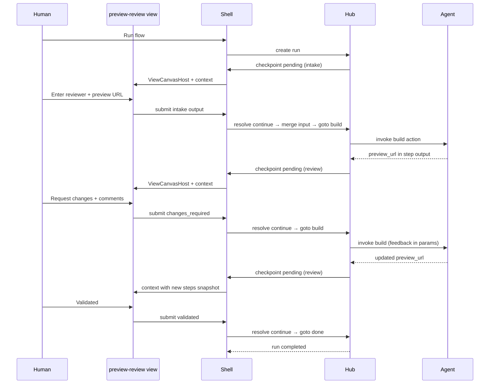

# Reference workflow — Preview review loop (normative)

**Status:** spec — phase 06 example shipped; tutorial prose in phase 10  
**Execution order:** **6 / 10** (example tree + acceptance after 03–05)  
**Example tree:** `examples/flows/preview-review-v2/`  
**Tutorial:** [01-local-preview-review](../../../../apps/docs/guide/tutorials/01-local-preview-review/)  
**Feedback:** [views-mid-flow-ui](../../../../feedbacks/2026-07-02-improvement-views-mid-flow-ui.md)  
**Decisions:** [04 orchestration A/B](./decisions/04-human-checkpoint-resolve-wire.md) · [05 triggers/intake](./decisions/05-triggers-only-checkpoint-steps.md) · [10 verification layers](./decisions/10-reference-workflow-verification-layered.md)

This document is the **executable spec** for the canonical human/agent review loop. Phases implement against it; acceptance proofs reference it.

---

## Dependencies (phases 03–05)

| Gap | Requirement | Status |
|-----|-------------|--------|
| **B1** | Checkpoint steps dispatch; run pauses at intake/review | ✅ [03-engine-completion](./03-engine-completion.md) |
| **B2** | `exec_context.steps` + `{{steps.*}}` templates (preview URL in view context) | ✅ [03-engine-completion](./03-engine-completion.md) |
| View SDK | `createViewMount`, view dev loop | ✅ [02-view-sdk](./02-view-sdk.md) |
| Scaffold | `hello-gate` shape aligned to this manifest | ✅ [04-space-flow-scaffold](./04-space-flow-scaffold.md) |
| ViewCanvasHost | Full primary-region checkpoint UI | ✅ [05-view-canvas-checkpoints](./05-view-canvas-checkpoints.md) |

Example tree: [`examples/flows/preview-review-v2/`](../../../../examples/flows/preview-review-v2/). Acceptance rows: [acceptance.md § RW](../../../current/acceptance.md#reference-workflow--preview-review-v2-rw).

---

## User outcome (unchanged from FDK review-loop)

One **session** (`ses_…`, human-visible title) tracks a preview review effort:

```text
agent builds preview → human reviews in custom UI → feedback
  → agent applies changes → human reviews again → … → human validates → done
```

**Session** = correlation container (journal, notifications, Desktop route).  
**Run** = one execution of the flow graph (`run_` — operator/debug); may pause at multiple **checkpoints**.  
**View** = full-screen React UI at each checkpoint — not shell chrome.

---

## Entity responsibilities

| Layer | Owns in this workflow |
|-------|------------------------|
| **Flow** (`flow.manifest.yaml`) | Step order: intake → build → review checkpoint → (branch) → build → review → … → terminal |
| **Protocol** | Session, run lifecycle, checkpoint pending/resolve, `exec_context.steps`, `disposition`+`output` |
| **View** (`murrmure/views/preview-review/`) | Preview iframe, comment thread UI, validated / request-changes actions |
| **Agent** | Invokes `build` action; reads checkpoint outcome via MCP or journal; does **not** own UI |
| **Shell** | Embeds view in **ViewCanvasHost**; maps view submit → resolve; admin chrome only |

---

## Flow manifest (normative)

```yaml
apiVersion: murrmure.flow/v1
name: preview-review
description: Localhost preview review until validated

triggers:
  manual: true

steps:
  - id: intake
    checkpoint:
      view: preview-review-intake   # reviewer + preview_url
      on_resolve:
        default: { goto: build }
        cancel: { fail: true }
  - id: build
    invoke:
      space: "{{origin_space}}"
      action: run_preview_agent
      params:
        preview_url: "{{input.preview_url}}"
        feedback: "{{steps.review.output.comments}}"
  - id: review
    checkpoint:
      view: preview-review
      assignees: ["{{input.reviewer}}"]
      on_resolve:
        when: output.outcome
        values:
          validated: { goto: done }
          changes_required: { goto: build }
        default: { goto: done }
        cancel: { fail: true }
  - id: done
    invoke:
      space: "{{origin_space}}"
      action: mark_validated
```

**`on_resolve`** (phase 03): checkpoint resolve branches the run — `validated` advances to `done`; `changes_required` jumps to `build` with `output` in `exec_context.steps.review.output`.

**First checkpoint merge:** intake `output` shallow-merges into `exec_context.input` so `{{input.preview_url}}` and `{{input.reviewer}}` resolve.

**Max rounds:** unbounded via `build` ↔ `review` loop until human validates. No fixed round count in manifest.

**Legacy compiler:** accepts `start:` alias for `triggers:` with `DEPRECATED_START_KEY` warning.

---

## View spec (`murrmure/views/preview-review/`)

Built with [phase 02 view-sdk](./02-view-sdk.md) (`createViewMount`).

### UI requirements

| Element | Data source |
|---------|-------------|
| Preview iframe | `steps.build.output.preview_url` from context |
| Comment thread | view local state + prior `steps.review.output.comments` |
| **Validated** | `submit({ outcome: "validated" })` |
| **Request changes** | `submit({ outcome: "changes_required", comments: [...] })` |

Shell maps both to `disposition: continue` + `output` ([decision 04](./decisions/04-human-checkpoint-resolve-wire.md)).

### Read APIs (via `useViewHubClient`)

- `journal.query({ session_id, run_id })` — optional live updates
- Gate `payload_ref` artifact — optional large preview metadata ([decision 08](./decisions/08-payload-ref-from-step-output.md))

---

## Runtime sequence



---

## Orchestration variants (both first-class — [decision 04](./decisions/04-human-checkpoint-resolve-wire.md))

Both share **same protocol state**: one `ses_*`, one `run_*` (declarative loop), growing `exec_context.steps`. Human resolves via **view only**.

### Pattern A — Flow-owned loop (primary tutorial path)

**Who advances:** flow engine after checkpoint resolve + `on_resolve` goto.

```text
Human clicks Run → intake checkpoint → build → review checkpoint → human submit
  → engine stores steps.review.output → goto build → invoke again with feedback template
  → review checkpoint again with updated steps snapshot in view context
```

**Agent model:** each `build` invoke runs configured executor. Agent **chat** may be new each round; **protocol context** is continuous via `session_id`, `run_id`, `steps.review.output` in params / `MURRMURE_INPUT`.

**Best for:** Tutorial 1a, non-agent authors, "Run button" Desktop UX.

### Pattern B — Agent-owned loop (secondary tutorial / skill)

**Who advances:** agent orchestration via MCP between human checkpoint resolves.

```text
agent: invoke(build)
agent: murrmure_wait_for_gate({ run_id })
agent: murrmure_journal_query / read steps.review.output
agent: if output.outcome == changes_required → invoke(build) with feedback
agent: wait_for_gate again …
```

Human still uses **view submit** (ViewCanvasHost). Agent does **not** call `murrmure_resolve_gate` for the human path.

**Best for:** Long-lived agent session, same conversation loop, explicit agent control.

### Docs / tutorial requirement (normative)

Phase **10** must ship **two tutorial tracks**:

| Doc | Shows |
|-----|--------|
| **Tutorial 1a** (or §A) | Flow-owned preview-review — Run in Desktop, engine loop, view submit |
| **Tutorial 1b** (or §B) | Agent-owned preview-review — same view + session, agent `wait_for_gate` loop |

Skill `reference/` must describe when to choose each pattern.

---

## Agent coordination (MCP)

| Tool | Use |
|------|-----|
| `murrmure_wait_for_gate` | Block until human resolves review checkpoint (Pattern B) |
| `murrmure_resolve_gate` | **Not** for human path — view submits |
| `murrmure_journal_query` | Read comments from step outputs |
| `murrmure_invoke_action` | Run `build` if flow uses agent-driven loop instead of `on_resolve` |

---

## Acceptance criteria (R1–R6) — layered verification ([decision 10](./decisions/10-reference-workflow-verification-layered.md))

**Honesty rule:** each row labeled `CI` | `manual` | `backlog`.

| # | Criterion | CI (phase 10) | Manual | Backlog |
|---|-----------|---------------|--------|---------|
| **R1** | `examples/flows/preview-review-v2/` passes `mrmr space apply --strict` | ✅ CLI/hub fixture | — | — |
| **R2** | Non-contributor scaffold/clone → Run Desktop | — | ✅ **10-T1** walkthrough | Playwright Desktop |
| **R3** | Preview in **ViewCanvasHost** (not drawer/form) | ✅ shell-web component test | ✅ 10-T1 visual | Playwright screenshot |
| **R4** | Request changes → build reruns → round 2 preview | ✅ hub-core `gate-loop-on-resolve` fixture | ✅ 10-T1 | Playwright + view reload |
| **R5** | Validated → run terminal completed | ✅ hub-core declarative-gate-chain | ✅ 10-T1 | — |
| **R6** | Zero FDK commands in workflow | ✅ grep CI gate | — | — |

**Manual release:** **10-T1** and **10-T1b** (agent-owned loop) each release until Playwright lands.

---

## Definition of done (phase 06)

### Code

- [x] `examples/flows/preview-review-v2/murrmure/` — normative manifest + actions + build script
- [x] `views/preview-review/` — iframe, comment thread, validated / request-changes (`createViewMount`)
- [x] `views/preview-review-intake/` — reviewer + preview URL intake checkpoint

### Tests (R1–R6 layers — [decision 10](./decisions/10-reference-workflow-verification-layered.md))

| ID | Layer | Proof |
|----|-------|-------|
| R1 | CI | `packages/cli/test/preview-review-v2-example.test.ts` — `apply --strict` |
| R3 | CI | `packages/shell-web/.../ViewCanvasHost.test.tsx` |
| R4 | CI | `fixtures/flow-engine/gate-loop-on-resolve.json` |
| R5 | CI | `fixtures/flow-engine/declarative-gate-chain.json` |
| R6 | CI | FDK grep in preview-review-v2 test |
| R2 | manual | 10-T1 (phase 10) |
| R3/R4 UX | manual | 10-T1 visual (phase 10) |
| R2–R4 full | backlog | Playwright Desktop |

### Docs

- [x] [acceptance.md](../../../current/acceptance.md) — RW fixture table
- [ ] Tutorial orchestration A/B prose — **phase 10**

---

## Mapping from FDK review-loop

| FDK (delete) | v2 (this spec) |
|--------------|----------------|
| `contract.json` states | `checkpoint.on_resolve` + step graph |
| `create_review_session` MCP | `mrmr flow run` + checkpoint opens view |
| `wait_for_review` | `murrmure_wait_for_gate` or declarative advance |
| Worker `ui/src/mount.tsx` | `murrmure/views/preview-review/` + view-sdk |
| `ins_…` instance id | `ses_…` session + `run_…` (debug) |
| Approve/reject protocol | `disposition` + `output.outcome` |

---

*End of reference workflow spec.*
