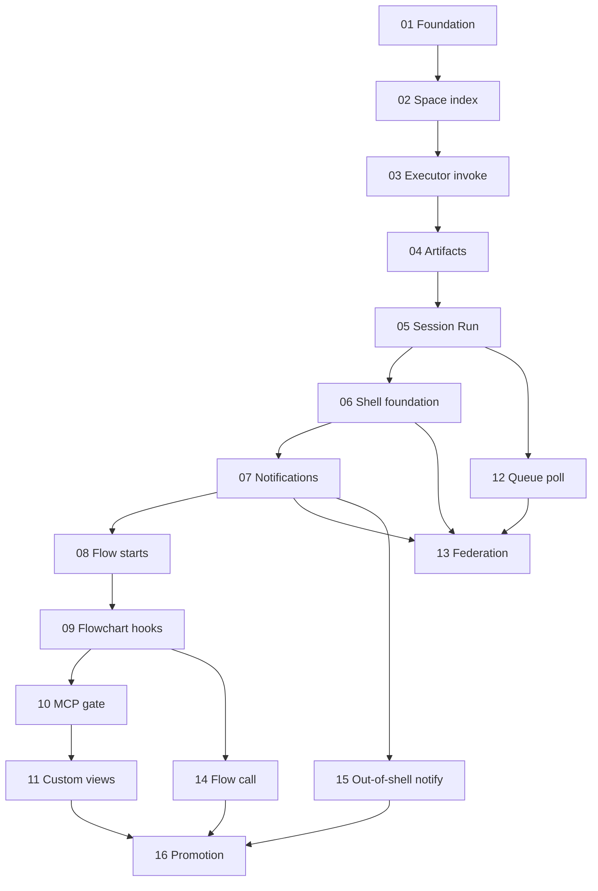

# Space–Flow–Protocol v2 — Implementation Plan

**Status:** executable plan — build order for rev-1  
**Date:** 2026-06-30  
**Normative spec:** [space-flow-protocol-v2.spec-rev-1.md](../space-flow-protocol-v2.spec-rev-1.md)  
**Architecture:** [space-flow-protocol-v2.architecture.md](../space-flow-protocol-v2.architecture.md)  
**Plan delta:** [plan-delta-rev1.md](../plan-delta-rev1.md) — deferred items pulled forward, dependency corrections  
**Doc/skill/MCP tracker:** [00-doc-skill-mcp-tracker.md](./00-doc-skill-mcp-tracker.md)  
**Philosophy:** [philosophy.md](../../../current/product/philosophy.md)

> **Nothing in this plan is unassigned.** Every item agreed in rev-1, architecture §16b, philosophy, and [plan-delta-rev1.md](../plan-delta-rev1.md) has a phase owner. rev-1 "defer" markers overridden by the delta are listed there explicitly.

---

## Product goal (unchanged)

> Teams run coordinated AI work across shared workspaces and machines: users define spaces and flows; the protocol delivers actions and artifacts; **sessions and runs** make cross-boundary work observable from start to finish.

**Boundary test (every PR):** *Is this protocol, flow, view rule, or space implementation?*

---

## How to use this plan

1. Read the phase doc **in full** before coding — it contains spec excerpts, file paths, tests, and doc updates.
2. Complete **all** checklist items in a phase before marking it done — including [doc/skill/MCP updates](./00-doc-skill-mcp-tracker.md).
3. Run phase acceptance script (CLI + shell demo steps) and CI gates listed in the phase.
4. Update phase status in the table below (`⬜` → `✅`).
5. Do not skip phases — later phases assume prior working behavior.
6. When rev-1 says "defer" but [plan-delta-rev1.md](../plan-delta-rev1.md) assigns a phase, **follow the phase doc**.

---

## Phase index

| # | Phase | Delivers (working system) | Depends |
|---|-------|---------------------------|---------|
| [00](./00-doc-skill-mcp-tracker.md) | Doc/skill/MCP tracker | Cross-phase integration checklist (living doc) | — |
| [01](./01-foundation-types.md) | Foundation & types | Rev-1 Zod contracts, CE journal shape, `Instance`→`Run` aliases, `ActionPort`/`ExecutorPort`, boundary CI baseline | — ✅ |
| [02](./02-space-index-cli.md) | Space index & CLI | `mrmr space init/link/apply`; `mrmr grant mint`; hub indexes `murrmure/` files; shell lists linked space | 01 ✅ |
| [03](./03-executor-invoke.md) | Executor & invoke | `ExecutorPort`, preflight, action invoke HTTP, `mcp_wake` shim; fail-fast on unreachable executor | 02 ✅ |
| [04](./04-artifacts-exchange.md) | Artifacts & exchange | `.mrmr.temp/` protocol, exchange store, 64 KiB cap, GC sweeper, legal hold | 03 ✅ |
| [05](./05-session-run-protocol.md) | Session & Run | Session/Run CRUD + list API, ACL/grant migration, MCP platform tools batch 1, step memo | 04 ✅ |
| [06](./06-shell-foundation.md) | Shell foundation | `shell-ui` (shadcn dark), `shell-client`, global SSE, CLI instruction routes; configure mode retired | 05 ✅ |
| [07](./07-notifications-gates-logs.md) | Notifications, gates, logs | Needs you, `/notifications`, gate resolve panel, `/logs`, landing space `PATCH /v1/me`, MCP batch 2 | 06 ✅ |
| [08](./08-flow-engine-starts.md) | Flow engine & starts | Flow manifest index, manual/event/schedule start, space home sections, skill rewrite for space-directory authoring | 07 ✅ |
| [09](./09-flowchart-parallel-hooks.md) | Flowchart, matrix, hooks | React Flow fork/join, matrix sibling runs, hook delivery (mandatory session+run), dedup chain | 08 ✅ |
| [10](./10-mcp-orchestration-gate.md) | MCP orchestration attach | Agent push `murrmure.flow.attach/v1`, validate gate, read-only graph preview, bind on approve | 09 ✅ |
| [11](./11-custom-views-view-sdk.md) | Custom views & view-sdk | `view-sdk`, `requires_view` + `view_ref`, form fallback; v1 mount worker demoted | 10 ✅ |
| [12](./12-queue-poll-workers.md) | Queue poll workers | External worker poll API, worker grant, in-process dev adapter | 05 ✅ |
| [13](./13-federation-remote.md) | Federation & remote | Virtual space bindings, `remote_hub` executor, cross-hub artifact materialize, optional `a2a` adapter | 12, 06, 07 ✅ |
| [14](./14-flow-call-composition.md) | Flow-call composition | `start_flow` step, cycle detection, ACL inheritance, `flow_call` start condition | 09 ✅ |
| [15](./15-out-of-shell-notifications.md) | Out-of-shell notifications | Email/desktop push for gate pending + run failed (assignees/watchers) | 07 ✅ |
| [16](./16-platform-hygiene-promotion.md) | Hygiene & promotion | Bun SQLite adapter, package renames, v1 shim removal, promote spec to `current/` | 11, 14, 15 ✅ |

**Status:** All phases ✅ — Murrmure Space–Flow–Protocol v2 complete per rev-1 + plan delta.

---

## Dependency graph

Phases **13** (federation) and **14** (flow-call) may run in parallel once their dependencies are ✅.

---

## Cross-cutting requirements (every phase)

| Requirement | Where enforced |
|-------------|----------------|
| PR checklist: protocol / flow / view / space? | Phase doc + [rev-1 §14](../space-flow-protocol-v2.spec-rev-1.md) |
| No prompts/skills/models in hub config | `studio-contracts` + hub-core review + conformance test |
| Journal entries CloudEvents-valid | `studio-contracts/conformance/cloudevents.test.ts` |
| Journal correlation | `session_id` + `run_id` extensions **and** derived `subject` path (§8.1) |
| `pnpm check:boundaries` green | Extended in phase 01 (`hub-core` ↛ `hub-persistence`), tightened in 16 |
| Doc/skill/MCP updates in same PR | [00-doc-skill-mcp-tracker](./00-doc-skill-mcp-tracker.md) |
| Vitest green | `pnpm test` + phase-specific projects |
| v1 shims until phase 16 | Removed in phase 16 — see CHANGELOG.md |

---

## Final system (after phase 16)

When all phases are ✅, Murrmure v2 delivers:

- Space-as-directory with `murrmure/` index (actions, executors, hooks, flows, views)
- Every execution visible as Session + Run(s) with step memo and journal replay fallback
- Reliable invoke with executor preflight and artifact exchange
- CLI-first mutation; observer shell with shadcn dark UI, flowchart, gates, notifications, logs
- Flow orchestration: start conditions, matrix parallel, gates, retry-as-new-run, flow-call composition
- MCP platform catalog (§10.9) for agents using and building flows; attach gate for agent-proposed graphs
- Hooks, custom views, external queue workers
- Federation: remote spaces, remote_hub executor, cross-hub artifacts
- Out-of-shell notifications; spec promoted to `studio-specs/current/`; v1 shims removed

---

## Related artifacts

| Doc | Role |
|-----|------|
| [space-flow-protocol-v2.spec-rev-1.md](../space-flow-protocol-v2.spec-rev-1.md) | Wire shapes, entity model, §16b resolutions, §10.9 MCP catalog |
| [space-flow-protocol-v2.architecture.md](../space-flow-protocol-v2.architecture.md) | Package graph, ports, testing placement |
| [plan-delta-rev1.md](../plan-delta-rev1.md) | Deferred → in-scope mapping, naming convention |
| [00-doc-skill-mcp-tracker.md](./00-doc-skill-mcp-tracker.md) | Per-phase doc/skill/MCP ownership |
| [hub/architecture.md](../../../current/hub/architecture.md) | v1 kernel ADRs (journal, federation sketch) |
| [cli/spec.md](../../../current/cli/spec.md) | Existing CLI commands to extend |
| [desktop/spec.md](../../../current/desktop/spec.md) | Bundled shell host |

---

*End of plan index.*
