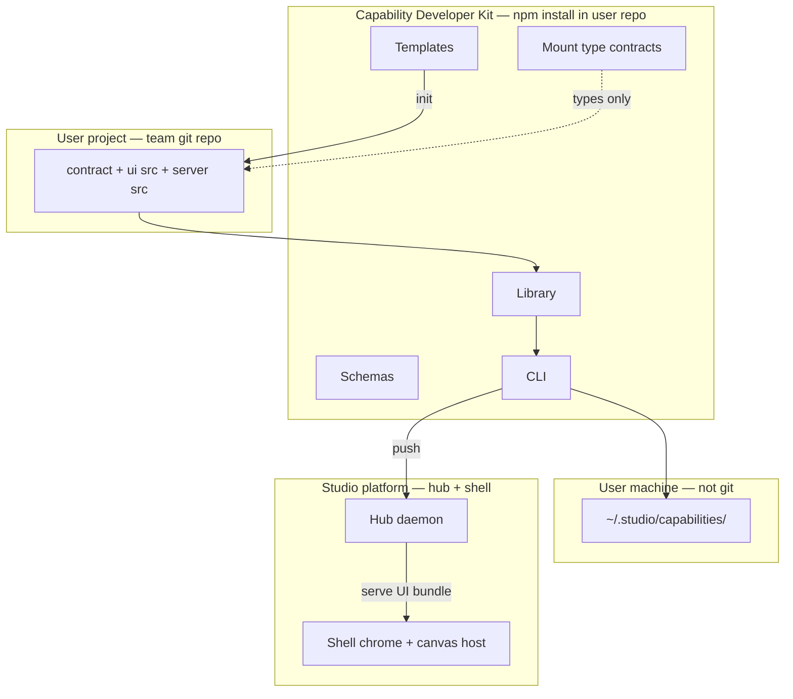

# Capability Developer Kit (CDK)

**Status:** normative (2026-06-21)  
**Implementation detail:** [02-sdk.md](./02-sdk.md) · **History:** [archives/execution/cdk-master-plan.md](../../archives/execution/cdk-master-plan.md)

---

## Definition

The **Capability Developer Kit (CDK)** is the **published builder surface** for Studio capabilities: everything a team installs in **their own repo or machine** to author, validate, bundle, push, and locally iterate on a workflow — without checking out or modifying the Studio platform monorepo.

A **kit** is not a single npm export. It is a **bounded product** composed of:

| Layer | Role |
|-------|------|
| **Schemas** | Normative shapes for manifest, contract, config, MCP tools |
| **Library** | Validate, build, stage, digest helpers |
| **CLI** | `studio capability …` commands |
| **Mount contracts** | Typed host/server interfaces between user code and platform |
| **Templates** | Scaffolds and optional examples shipped *inside* the kit |
| **Test harness** | Contract tests + CLI test runner |

The CDK **does not** include the hub, shell Configure UI, evolution engine, or any domain workflow UI.

---

## Kit vs platform vs user project



| Concern | Owner |
|---------|--------|
| **What the workflow means** (states, gates, domain UI, MCP behavior) | User project |
| **How to package and ship it** (validate, build, push, dev loop) | CDK |
| **Enforcement and runtime** (evolution, auth, mount, canvas slot) | Platform |

**Invariant CDK-1:** No artifact required for a green capability build may live only in the platform repo.

**Invariant CDK-2:** The shell never imports UI from the CDK or from user source — only from hub-served bundles after live apply.

**Invariant CDK-3:** There is no capability catalog in the platform; the CDK creates installs via `evolution.draft.upsert` and user-supplied `bundle_digest`.

**Invariant CDK-4:** `studio capability init` scaffolds a strict React project; framework-agnostic templates are not part of the default kit.

**Invariant CDK-5:** Generated dependency versions are exact pins; no ranges in scaffolded `package.json`.

---

## What is in the kit

### 1. Published packages

| Package | Contents |
|---------|----------|
| `@studio/capability-sdk` | Zod schemas, `validateCapabilityRoot`, `buildCapabilityRoot`, staging paths |
| `@studio/capability-dev-kit` | React runtime helpers (bridge client, providers, hooks, error-state components) |
| `@studio/capability-sdk/host` | `CapabilityHostContext`, UI `mount()` signature |
| `@studio/capability-sdk/server` | `CapabilityServerContext`, `mountRoutes()` signature |
| `@studio/capability-sdk/cli` | `studio` binary (re-export or bin entry) |

Optional peer (not part of core kit, documented as recommended):

| Package | Role |
|---------|------|
| `@murrmure/hub-client` | Typed HTTP from user UI/server — user may use raw `fetch` instead |

### 2. CLI commands (kit surface)

All commands operate on a **user-project path** or **staged digest** — never on platform `packages/`.

| Command | Kit responsibility |
|---------|-------------------|
| `studio capability init` | Emit template tree into user-chosen directory |
| `studio capability validate` | Offline Lens A (+ Lens B warnings) |
| `studio capability build` | Bundle ui + server → `~/.studio/capabilities/` |
| `studio capability push` | HTTP install draft with bundle bytes or local-path |
| `studio capability test` | Run user vitest + optional hub integration |
| `studio capability dev` | Watch, rebuild, signal canvas reload |
| `studio capability dev --sim` | Thin local shell + simulated Studio state machine for local UI/E2E |
| `studio capability promote` / `apply` | Evolution HTTP parity with Configure |

Auth: env vars or `~/.studio/hubs/shared.json` — see [02-sdk.md](./02-sdk.md).

### 3. Schemas (normative artifacts in every capability)

| File | Schema owner | Validated by |
|------|--------------|--------------|
| `capability.manifest.json` | CDK v1 — [05-manifest-and-bundle-schema.md](./05-manifest-and-bundle-schema.md) | CLI + hub Lens A |
| `contract/contract.json` | Hub contract v2 | CLI + hub |
| `contract/config.schema.json` | JSON Schema | CLI + Configure |
| `contract/mcp-tools.json` | CDK MCP registry | CLI + hub MCP rebuild |

Manifest v1 fields — `contract_ref_id` **not** in author manifest (hub assigns):

```typescript
{
  schemaVersion: "1",
  id: string,
  version: string,
  routes_prefix: string,
  mcp_tools_by_version: Record<string, string[]>,
  ui: { entry: string, canvas_route: string, shell_html?: string },
  server: { mount_module: string },
  config_schema?: string,
  tests?: { contract?: string }
}
```

### 4. Mount contracts (only platform coupling in user code)

**UI** — user exports:

```typescript
function mount(root: HTMLElement, ctx: CapabilityHostContext): () => void
```

**Server** — user exports:

```typescript
function mountRoutes(app: Hono, ctx: CapabilityServerContext): void
```

Platform shell and hub import **built bundles**, not user TypeScript source. Types come from the kit.

### 5. Templates (shipped inside kit tarball)

| Template | Purpose |
|----------|---------|
| `templates/default/` | Full strict React tree: contract, React app shell, visual error states, server stub, tests |
| `templates/minimal/` | Contract + React mount/app baseline + server stubs |
| `templates/examples/review-loop/` | Optional reference workflow — **copied to user disk**, not linked from shell |

Templates are **not** capabilities installed in the hub by default.

### 6. Test harness

| Piece | In kit? |
|-------|---------|
| Contract reachability test utilities | Yes |
| `studio capability test` runner | Yes |
| User-written vitest files | User project |
| Playwright simulated-shell E2E harness | Yes (scaffolded in init output) |
| Hub integration test helpers | Yes (optional module) |

---

## What is not in the kit

| Excluded | Belongs to |
|----------|------------|
| `@murrmure/shell-web` Configure + runtime chrome | Platform |
| `@murrmure/hub-daemon`, `@murrmure/hub-core` | Platform |
| Evolution FSM implementation | Platform |
| Domain canvas components (preview, annotations, spec editor) | User project |
| Capability marketplace / bundled install list | — (non-goal) |
| Visual contract editor | Future Configure; not CDK v1 |
| MCP platform tools (`transition`, `emit_event`, …) | Platform MCP adapter |

---

## Kit tiers

Implementation phases map to **what ships on npm**:

| Tier | Phase | Ships |
|------|-------|-------|
| **CDK-min** | BC0–BC2 | Schemas, validate, build, stage, push CLI |
| **CDK-standard** | + BC3–BC4 | Host/server types, templates, test runner, promote/apply CLI |
| **CDK-dev** | + BC5 + BC5b | `dev` watch, `dev --sim`, local-path upload, example templates |

A team can ship a capability with **CDK-min**; **CDK-dev** improves iteration only.

---

## Distribution model

| Property | Rule |
|----------|------|
| **Install target** | User project `devDependencies` (or global CLI for operators) |
| **Versioning** | Semver independent of hub `coreVersion` |
| **Scaffold dependency policy** | `@studio/capability-sdk` and `@studio/capability-dev-kit` are exact version pins in generated `package.json` |
| **Compatibility** | Manifest declares `schemaVersion`; hub rejects unknown major |
| **Examples** | Inside kit package under `templates/examples/` — never required at runtime |

```bash
npm install -D @studio/capability-sdk
npx studio capability init my-flow --dir ./workflows/my-flow
cd ./workflows/my-flow && npm install
```

No Studio monorepo clone required.

---

## Relationship to “SDK” naming

| Term | Meaning |
|------|---------|
| **CDK** | Whole builder product (schemas + lib + CLI + templates + types + tests) |
| **`@studio/capability-sdk`** | Primary npm package name — implements the CDK |
| **`@studio/capability-dev-kit`** | Runtime authoring helpers for strict React capability projects |
| **P5 scaffold** | Historical platform-repo stub; superseded by CDK as published kit |

In docs: prefer **CDK** when talking about builder experience; prefer **`@studio/capability-sdk`** when talking about npm install lines.

---

## Agent and CI consumers

The CDK is the same surface for humans, coding agents, and CI:

| Consumer | Typical use |
|----------|-------------|
| Human builder | `init` → edit → `build` → `push` → evolution via CLI or Configure |
| Agent with `capability:install` | Edit repo → `validate` → `push` to **sandbox only** (PAR-03) |
| CI (`STUDIO_DEPLOY_TOKEN`) | `build` → CI push route with attestations — not general `--target live` |

Agents do not need a separate kit — grants + CDK CLI + user repo.

---

## Acceptance (kit-level)

Kit is **done** for a tier when:

| Tier | Criteria |
|------|----------|
| CDK-min | [acceptance.md](./acceptance.md) rows 1–5 green without platform repo |
| CDK-standard | + rows 6–8 (evolution + live UI + dynamic tools) |
| CDK-dev | + rows 16–18 (`dev` reload + `dev --sim` + Playwright simulated E2E) |

---

## Related docs in this directory

| Doc | CDK aspect |
|-----|------------|
| [05-manifest-and-bundle-schema.md](./05-manifest-and-bundle-schema.md) | Canonical manifest + digest |
| [06-install-push-apply-http-contract.md](./06-install-push-apply-http-contract.md) | Install v2 + CLI map |
| [09-security-execution-boundaries.md](./09-security-execution-boundaries.md) | Worker + iframe model |
