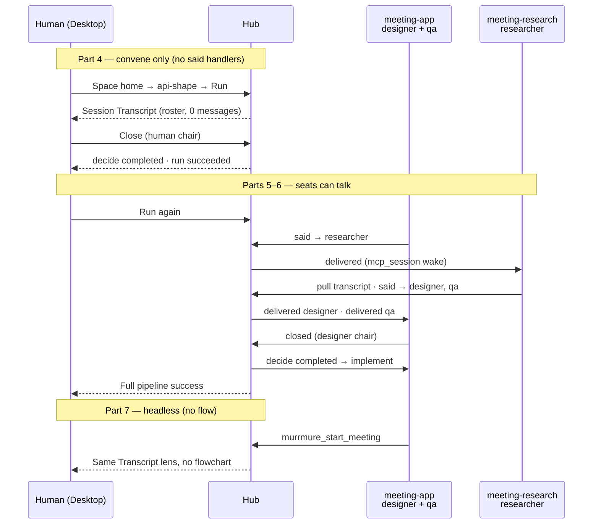

# Tutorial 1b — Meetings (plan only)

**Status:** draft plan (2026-08-17). **Do not write the pages yet.**  
**Pages land after implementation slice 8** — see §8 and [architecture.md](./architecture.md) §5.  
**Product:** [spec.md](./spec.md) · [shell-lens.md](./shell-lens.md) · [flow-step.md](./flow-step.md) · [ADR-016](../../ADR/ADR-016-meeting-protocol.md)  
**Pedagogy source:** [Tutorial 1a v3](../../../apps/docs/guide/tutorials/01-local-preview-review-v3/) + [tutorials index](../../../apps/docs/guide/tutorials/index.md)  
**Doc wave:** [doc-surfaces.md](./doc-surfaces.md) §3 / §8

This file is the writer brief. A later author drafts pages from it without inventing structure, story, file list, or disclosure order.

**Numbering:** index label **1b** (second active intro path, after 1a). Folder **`02-meetings/`** so it does not collide with the *retired v2* tutorial that was also called “1b.” The index must say that in one line.

---

## 1. Pedagogy principles

### Copied from 1a (non-negotiable)

These are the rules Tutorial 1a actually practices, not slogans. 1b must feel like the same course.

| Rule | What 1a does | What 1b must do |
|------|----------------|-----------------|
| **One concept per beat** | Part 2 = flow is a description. Part 3 = view. Part 4 = run. Part 5 = handlers. | Do not teach personas + `meeting:` + `said` + Transcript in one page. |
| **You write every file yourself** | Empty `handlers.yaml`, then the exact manifest, then the view, then handlers. No `Include example flow`. | No hello-meeting template, no cloned fixture space, no “skip to applied YAML.” `mrmr setup` → **No** example files, both spaces. |
| **Start → finish, then extend** | Intake-only run completes (Cancel fail / Submit success) *before* `write_spec` / `build`. | Empty room + **human Close** completes a run *before* anyone `said`. Then extend talk, then extend the graph. |
| **No pre-built packages** | Index: “no pre-built flow packages, no clone the repo and skip ahead.” | No kernel `.mrmr/views/meeting`. No published meeting flow package. |
| **Views only when needed** | View exists because intake is a human file contract. | Chat is **never** a View. This tutorial writes **zero** view packages. Validation Views are out of scope (see also only). |
| **Handlers after you can see a run** | Part 4 run has no command/agent handlers. | Part 4 convenes and closes with **no** `mrmr.meeting.said` handlers. Roster is visible; seats are silent. |
| **Cleanup last** | Archive + `git commit` is Part 6. | Commit authored `.mrmr/` (+ implement output) in Part 7. Do not invent a “archive the chat” step. |
| **Progressive disclosure of MCP / journal / contracts** | Part 1: `murrmure_space_status`. Part 4: glance at run/journal terms. Part 5: live `murrmure_resolve_step` contract. | Part 1: status only. Part 2: `murrmure_list_personas`. Part 4: Desktop Transcript, **not** journal dump. Part 5: `transcript` + `emit` `said`. Part 6: `closed`. Part 7: `start_meeting`. Never `journal_query` as the chat. |

1a also does these craft things — copy them:

- **Concept sentence** at the top of every part (`**Concept:** …`).
- **Exact fences** (`<!-- tutorial-meetings-fence:<id> -->`) + checkpoint lists + troubleshooting tables.
- **“What you should see”** after every Desktop action (status words, not vibes).
- **On-purpose failure** as a teacher (1a Cancel → failed). 1b: omit `participant` → `PERSONA_HANDLER_UNSCOPED`; non-chair close → `MEETING_CHAIR_REQUIRED`.
- **Diffs when extending** a file the reader already wrote (1a Parts 5–6).
- **Apply quiescence** reminder before re-apply while a meeting is still open.
- **Index mermaid** of the whole story; per-part ASCII traces of journal *types*, not raw JSON.

### Meeting-specific principles (adaptations)

1. **Chat is shell.** `/sessions/:id` Transcript is the human lens. Same split as 1a flowchart vs ViewCanvasHost — protocol state is always visible in the shell; a View is only for domain validation, and this tutorial never builds one.
2. **Dashboard trigger is Run.** Space home **Run** on a flow that has `meeting:` is how the reader starts. No `/meetings`, no “New meeting” wizard, no shell composer.
3. **Headless convene is later.** `murrmure_start_meeting` / `mrmr meeting start` exists, but only after the flow path has been seen end-to-end (Part 7).
4. **Humans do not `said` in v1.** No compose box. No “type here as the operator.” Humans **read** and, when they are the chair, **Close**. Agents `said` and pull the transcript.
5. **Personas are ads, not dispatch.** `personas.yaml` is what others are told a seat is for. Handlers wake seats. Hub never interprets `asks` / `requests`.
6. **`on.event.participant` is required** when the space has personas. Unscoped `mrmr.meeting.said` handlers fail apply (`PERSONA_HANDLER_UNSCOPED`).
7. **Prefer `mcp_session`.** `shell_spawn` per `said` is the wrong executor for a room (new harness, empty brain). 1a’s `cursor agent -p` pattern is *not* copied for meeting wakes.
8. **Assignment prompt is thin.** Trigger + `since_seq`. Agents **pull** `murrmure_meeting_transcript`. Do not paste the room into the handler `prompt:` and do not tell the agent to `journal_query`.
9. **Close is not `resolve_step`.** Chair emits `mrmr.meeting.closed` (or human Close). Hub resolves the meeting step. 1a trained `murrmure_resolve_step` — this tutorial must unteach that for the room step.
10. **Meetings are not the 5-minute path.** 1a stays “start here.” Quick start gets at most one “also: meetings” link.
11. **Do not rewrite 1a.** No meeting sentences inside `01-local-preview-review-v3/`.
12. **Two spaces, one hub.** Target story is two personas in space A + one persona in space B. Research does **not** own the flow. The flow lives on the app space; the other space only needs catalog + handler.
13. **`query_ask` is the other door.** Mention once as a non-goal. Meetings are free `said`, not typed RPC.

### What 1a index language must *not* be copied blindly

`apps/docs/guide/tutorials/index.md` currently says every tutorial ends in **ViewCanvasHost**. That sentence is 1a-shaped. When 1b ships, change it to: 1a ends in a View; 1b ends in the **session Transcript**. Do not force 1b into ViewCanvasHost to satisfy that line.

---

## 2. Story in one line + mermaid

```text
Run api-shape → empty room (3 seats) → human Close
  · then designer said → researcher · researcher replies (+ qa)
  · designer Close → implement writes the outcome
  · then the same room shape without a flow (headless)
```



**Cast (fixed names — do not rename in the pages):**

| Folder | Slug | Personas | Owns |
|--------|------|----------|------|
| `~/work/meeting-app` | `meeting-app` | `designer`, `qa` | Flow `api-shape`, dashboard **Run** |
| `~/work/meeting-research` | `meeting-research` | `researcher` | Catalog + said handler only |

Leave `~/work/my-first-space` from 1a alone. Do not extend `my-dev-flow`.

---

## 3. Beat table

| Part | File | Concept (one) | Files the reader writes | What they SEE in Desktop | What they do NOT learn yet |
|---:|---|---|---|---|---|
| **1** | `01-two-spaces.md` | One hub, two spaces — a room spans seats’ homes | Two new folders; each `.mrmr/space/space.yaml` + empty `handlers.yaml` via `mrmr setup` (No examples). Fill the **workspace card** (two `spc_…`, two `con_…`) | Sidebar: `meeting-app` and `meeting-research` (1a space may still be there). Each space home: **no flows**. | Personas, `meeting:`, Transcript, grants beyond `local-tools/v1`, second Desktop, views |
| **2** | `02-personas.md` | `personas.yaml` is ads. Hub does not dispatch on `asks` / `requests` | `meeting-app/.mrmr/space/personas.yaml` (`designer`, `qa`); `meeting-research/.mrmr/space/personas.yaml` (`researcher`) | After apply: no new Run button (still no flow). Optional: space index / doctor mentions catalog. **MCP:** `murrmure_list_personas` returns blurbs only — no prompts | `meeting:` facet, handlers, `participant`, convene, Transcript |
| **3** | `03-meeting-flow.md` | `meeting:` is a protocol facet on a normal step. A flow still does nothing until Run. **No view.** | `meeting-app/.mrmr/flows/api-shape/flow.manifest.yaml` (one step `decide`, human chair, three seats, literal `spc_…`). Apply. | Space home **Flows** card: `api-shape` with **Authored here** + **Runnable**. Flowchart: rectangular `decide` (not a diamond unless branches are custom). Side panel: `meeting` roster + goal; resolver **no view**. | Transcript contents, Close, `said`, handlers, `{{input.*}}` as the required path, headless convene |
| **4** | `04-run-and-read-the-room.md` | Session **is** the room. Transcript is shell. Journal is not the chat. | None (maybe a sticky note of `ses_…` / `run_…`) | **Run** → `/sessions/:id` defaults to **Transcript**. Title, goal, `open`, roster `designer@meeting-app`, `qa@meeting-app`, `researcher@meeting-research`, **0 messages**. Flowchart tab still shows `decide` working. **Close** (human chair) → `closed`, run **succeeded**. Sessions list: meeting badge. **Needs you** only for that Close, not for talk. | `said`, receipts, `mcp_session`, `event:emit`, chair-as-persona, implement, journal JSON, compose box (there isn’t one) |
| **5** | `05-wake-seats.md` | Seats wake from `on.event.participant` + `mcp_session`. Personas ≠ handlers. First `said` is agent-authored. | Both `handlers.yaml`; **grants** `event:emit` + `journal:read` on both connections. Exact agent prompts (not files). | New **Run**. After designer `said`: one message, `to: researcher`, receipt **delivered**. Researcher seat **working**. QA has **no** new assignment. Transcript updates live. Human **Close** still (chair still human). | `in_reply_to`, artifacts, `{ all: true }`, designer-as-chair, `implement`, `start_meeting`, `resolve_step` on `decide`, `query_ask`, `shell_spawn` per message, View |
| **6** | `06-talk-and-advance.md` | Close completes the meeting step; the flow continues. Talk can address many, reply, attach. | Diff `flow.manifest.yaml`: chair = designer; `completed` → `implement`; add `implement` step. App `handlers.yaml`: `implement` `shell_spawn` `complete: auto`. | Designer `said` with `in_reply_to` + artifact link. Researcher `said` → `[designer, qa]` (two receipts). Later `said` → designer only: QA does **not** wake. Designer **closed**; shell Close denied (`MEETING_CHAIR_REQUIRED` if tried). `implement` runs; `docs/api-shape.md` appears. Run succeeded. | Headless convene, validation View, compose, turn-taking, hub summaries, `query_ask` |
| **7** | `07-headless-and-cleanup.md` | Same room without a flow. Then commit what you authored. | None new for convene (MCP/CLI). Git add/commit of allowlisted files. | `murrmure_start_meeting` → new `ses_…`, **no** `api-shape` run. Transcript still default. Close. Then repo has a clean commit of `.mrmr/` + `docs/api-shape.md`. | Memory, federation relay, human `said`, crash resurrection, `/meetings` route |

**Reader workspace card** (Part 1, keep using it):

```text
meeting-app:       folder ________  slug meeting-app       spc_ ________  con_ ________
meeting-research:  folder ________  slug meeting-research  spc_ ________  con_ ________
Desktop hub:       http://127.0.0.1:8787  (one app, not two)
Agent chat A:      opened on meeting-app
Agent chat B:      opened on meeting-research
```

---

## 4. Exact page outline per part

Writer voice: same as 1a — short, imperative, “you should see,” then a checkpoint. Sacrifice flourish. Every snippet is copy-pasteable except the two `spc_…` literals (call them out every time).

Fence prefix: `tutorial-meetings-fence:`. Register in a new `test-utils/spaces/tutorial-meetings/fences.json` when pages are written (mirror ADR-005 / tutorial-v3 harness). Progressive snapshots: Parts 2, 3, 5, 6 (Part 1 is setup-only; Part 4 has no new files; Part 7 is MCP + git).

---

### Index — `apps/docs/guide/tutorials/02-meetings/index.md`

**H1:** Tutorial 1b — A meeting in seven beats

**Lead (3–4 sentences):** You already finished 1a. This tutorial is the next path, not the first. You will put two voices in one space and a third voice in another space into **one session**, read the chat in Desktop (not a View), and let a chair close the room.

**H2:** How this tutorial is different

| | **1a (required first)** | **This tutorial (1b)** |
|---|-------------------------|------------------------|
| **Goal** | One space, one flow, one View, one agent step | Two spaces, one room, shell Transcript |
| **Human UI** | Custom intake View | No View. Transcript + Close |
| **Start** | **Run** on `my-dev-flow` | **Run** on `api-shape` (headless only in Part 7) |
| **Parts** | 6 | 7 |

**H2:** What you will learn — copy the beat table’s Concept / “You see it when…” columns (1a style).

**H2:** Story in one line — the text + mermaid from §2.

**H2:** Pages (follow in order) — 7 links.

**H2:** Prerequisites — §5, condensed.

**H2:** After this tutorial — `guide/meetings.md`, space-handlers (`on.event.participant`), shell-routes, **not** 1a, **not** archived v2 1b.

**H2:** Next → Part 1.

Do **not** include a ViewCanvasHost screenshot path. Do **not** promise a 5-minute finish.

---

### Part 1 — `01-two-spaces.md`

**H1:** Part 1 — Two spaces on one hub  
**Concept:** A meeting seat lives in a **space**. Two spaces on the **same** local hub can sit in one room. You are not launching a second product.

**H2:** Before you start

- 1a done. Desktop already running. Do **not** `mv ~/.murrmure` (that wipes 1a).
- Do **not** reuse `my-first-space`.
- One Desktop. One hub (`127.0.0.1:8787`).

**H2:** Step 1 — Why two folders  
Short: designer + qa share the app repo; researcher has a different repo. Same machine is fine. Federation is not this tutorial.

**H2:** Step 2 — Create `meeting-app`

```bash
mkdir -p ~/work/meeting-app && cd ~/work/meeting-app
git init
mrmr setup
```

Wizard: name/slug `meeting-app`. **Include example flow?** **No.** Connect tools? **Yes** (same as 1a). Reload. `murrmure_space_status` → this `spc_…`.

Show expected tree (1a Part 1 shape): empty `handlers.yaml`, `space.yaml` slug `meeting-app`, no `flows/`.

Fence: `part-1-app-space`, `part-1-app-empty-handlers`.

**H2:** Step 3 — Create `meeting-research`

Same, in a **second terminal**, folder `~/work/meeting-research`, slug `meeting-research`. Connect tools **for this space** (second `con_…`). Reload **that** context. `murrmure_space_status` must print the **research** `spc_…`, not the app one.

Fence: `part-1-research-space`, `part-1-research-empty-handlers`.

**H2:** Step 4 — Two agent chats (do this now, talk later)

- Chat A: workspace = `meeting-app`. After reload, `murrmure_space_status` = app.
- Chat B: workspace = `meeting-research`. Status = research.
- If both chats report the same `spc_…`, stop — MCP is pointed at one connection. `mrmr space doctor --fix` **in the wrong folder**.

Recommend **two Cursor windows**, not one multi-root workspace (one connection per folder is the 1a model).

**H2:** Step 5 — Check Desktop

You should see:

- Sidebar lists **meeting-app** and **meeting-research**
- Each home: no runnable flow yet
- Still one hub — switching spaces does not start a second app

```bash
# in each folder
mrmr space status
mrmr doctor
```

**H2:** Fill the workspace card  
Copy both `spc_…` and `con_…`. You will paste the space ids into the flow in Part 3.

**H2:** Checkpoint  
**H2:** Next → Part 2

**Troubleshooting (Part 1):**

| Symptom | Cause | Fix |
|---------|-------|-----|
| Second setup created a second hub / empty sidebar | Second Desktop instance or reset `~/.murrmure` | Quit extras; one Desktop; do not move the state dir |
| Both chats same `spc_…` | One MCP config reused | Open the other folder; `mrmr space doctor --fix`; reload that tool |
| Example flow appeared | Said Yes to examples | Delete `.mrmr/flows/*`, apply, continue — do not “use the sample meeting” |
| `my-first-space` gone | State reset | Restore from backup if you have one; 1b does not require the 1a files on disk, only the skills |

---

### Part 2 — `02-personas.md`

**H1:** Part 2 — Advertise seats  
**Concept:** `.mrmr/space/personas.yaml` is a **catalog of ads**. The hub indexes handles and blurbs. It does **not** pick a handler, spawn an agent, or require anyone to follow `asks` / `requests`.

**H2:** Step 1 — App catalog (two voices, one space)

Write `~/work/meeting-app/.mrmr/space/personas.yaml`:

Fence `part-2-app-personas`:

```yaml
version: 1
personas:
  - id: designer
    summary: Product UI in this repo
    asks:
      - UX review of a flow or screenshot
    requests:
      - critique an artifact
  - id: qa
    summary: Breaks the happy path
    asks:
      - empty states, auth, pagination edges
    requests:
      - a repro, not a vibe
```

**H2:** Step 2 — Research catalog (one voice)

Fence `part-2-research-personas`:

```yaml
version: 1
personas:
  - id: researcher
    summary: Technical research and prior art
    asks:
      - literature / papers on a topic
      - latency or perf evidence
    requests:
      - attach a written brief
      - recommend a choice (not decide)
```

**H2:** What you did not write  
No prompts, no model, no skills, no `on:` bindings. Those stay in `handlers.yaml` / `agent.md`. If the catalog says “attach a brief” and they never do, the hub does not care.

**H2:** Step 3 — Apply both

```bash
cd ~/work/meeting-app && mrmr space apply --strict
cd ~/work/meeting-research && mrmr space apply --strict
```

**H2:** Step 4 — List ads (MCP)

In chat A: `murrmure_list_personas` (or the shipped CLI equivalent — writer binds the real tool name from `reference/mcp-tools.md` at write time).

You should see `designer` and `qa` with summaries. **No handler ids. No prompt text.**

In chat B: `researcher` only.

**H2:** Checkpoint  
**H2:** Next → Part 3

Do **not** convene yet. Do **not** write handlers yet.

---

### Part 3 — `03-meeting-flow.md`

**H1:** Part 3 — A step that is a room  
**Concept:** `meeting:` is a **facet** on a resolver-agnostic step (same family as `artifact_slots`). The step *is the room* until the meeting closes. The file still does not run code, open a View, or spawn seats.

**H2:** Why there is no Part-3 view  
1a needed a View because a human had to attach a file. Here the human only **watches** and later **Closes**. Binding `view_resolver` on `decide` for chat is an anti-pattern. Skip `mrmr space view init`.

**H2:** Step 1 — Flow shell

Create `.mrmr/flows/api-shape/flow.manifest.yaml` in **meeting-app only**.

Header + `triggers.manual: true`. Explain triggers the 1a way in 4–5 lines, then: research space does not get a copy of this flow.

**H2:** Step 2 — One step: `decide`

Complete manifest. Fence `part-3-flow`. Writer substitutes the two ids from the workspace card. **Do not** use `{{input.*}}` as the required path (Desktop **Run** has no roster form in v1; a View to collect ids would teach the wrong lesson).

```yaml
apiVersion: murrmure.flow/v1
name: api-shape
description: Agree the public list endpoint in a room, then stop.

triggers:
  manual: true

steps:
  - id: decide
    description: Designer, QA, and researcher agree the API shape.
    meeting:
      participants:
        - { space: "spc_PASTE_APP", persona: designer }
        - { space: "spc_PASTE_APP", persona: qa }
        - { space: "spc_PASTE_RESEARCH", persona: researcher }
      chair: { human: true }
      goal: Pick an approach for the public list endpoint
```

Notes the page must spell:

- `chair: { human: true }` — you will Close in the shell (Part 4). Persona chair comes in Part 6.
- Default `completed` / `failed` are enough; last step ends the run.
- `meeting:` names **spaces + handles**, not prompts.
- Duplicate `(space, persona)` → reject (do not demo unless troubleshooting).
- Unknown persona → `PERSONA_NOT_FOUND` (if they typo `designr`).

**H2:** Step 3 — Apply (yes, now — no view to wait for)

```bash
cd ~/work/meeting-app && mrmr space apply --strict
```

You should see `api-shape` on the app space home. Research space home still has no flow.

**H2:** Step 4 — Inspect the graph (do not Run yet)

1a Part 4 inspects before Run; here we split inspect (end of 3) vs Run (start of 4) so Part 3 stays “the description.”

You should see:

- Rectangular `decide`
- Side panel: meeting roster (persona + space labels, not only `ptc_*`), goal text, chair = human
- **No** `view_resolver` / spec-intake
- **Run** in the flow-page header

**H2:** Portable later  
Callout: production flows may use `{{input.app_space}}`. This tutorial pastes ids so **Run** stays the trigger. Do not build an intake View “just for ids.”

**H2:** Checkpoint  
**H2:** Next → Part 4

---

### Part 4 — `04-run-and-read-the-room.md`

**H1:** Part 4 — Run it and read the room  
**Concept:** A **run** that opens `decide` **convenes** on **this session**. The session *is* the meeting. You read **Transcript**, not `/logs`.

**H2:** Before you start  
Parts 1–3 applied. No said handlers yet — that is correct.

**H2:** Step 1 — Run from the dashboard

Desktop: **meeting-app** → **Flows** → **api-shape** → **Run**.

You should see:

- New session `ses_…`, run `run_…`
- Route `/sessions/:id` with **Transcript** as the **default** pane
- Status **open**
- Goal text from the manifest
- Roster of **three** seats, labels like `designer@meeting-app`
- **No messages**
- **No compose box**
- Flowchart / journal tabs still exist (operator), not the chat
- Step `decide` still **open** / working

ASCII:

```text
flow.run.started
  └─ step.opened(decide)
       └─ mrmr.meeting.convened   (3 ptc_*, chair=human)
            └─ run remains open  (no said handlers fire)
```

**H2:** Step 2 — What you are not looking at

- `/logs` filtered to `mrmr.meeting.*` is retrieval, not the product chat.
- Do not ask the agent to `journal_query` and summarize the room.
- **Needs you** may show Close (human chair). It must **not** badge “new message” (there are none, and v1 does not badge every `said` later either).

**H2:** Step 3 — Close as human chair

Click **Close**. Optional reason/outcome fields if the shell has them; empty is valid.

You should see:

- Transcript status **closed**
- `decide` resolved **completed**
- Run **succeeded**
- Historical transcript still readable
- A second **Run** is allowed (failed/canceled/closed run does not hold capacity; mention `max_concurrent_runs` only if the writer adds a policy — default omit, unlimited)

ASCII:

```text
mrmr.meeting.closed
  └─ step.resolved(decide, completed)
       └─ run.terminal(success)
```

**H2:** Step 4 — Five-minute tour (terms only)

| Term | What you just saw |
|------|-------------------|
| **Session** | The room (`ses_…`) |
| **Run** | One walk through `api-shape` |
| **Meeting** | Facet on `decide` — not a new entity type |
| **Roster / participant** | A seat `{ space, persona }` → `ptc_*` |
| **Transcript** | Fold of `mrmr.meeting.*` only |
| **Journal** | Full audit; includes hooks/runs you do not need in the chat |
| **View** | Not used |

**H2:** Troubleshooting

| Symptom | Cause | Fix |
|---------|-------|-----|
| ViewCanvasHost / blank canvas | Someone bound a view or expected 1a | No view on `decide`; open **Sessions** → Transcript |
| No **Run** | Flow not applied / wrong space | Apply from `meeting-app` |
| `PERSONA_NOT_FOUND` | Typo or research not applied | Part 2 apply both; ids match catalog |
| Convenor / invite error | App run cannot read research | Same hub; both spaces created by you; re-check `spc_…` in the manifest |
| Compose box | Product bug or stale build | v1 has none — do not “type as designer” |
| Run stuck open | Did not Close | You are the chair |

**H2:** Checkpoint  
**H2:** Next → Part 5

---

### Part 5 — `05-wake-seats.md`

**H1:** Part 5 — Wake a seat  
**Concept:** When someone `said` to a seat, the hub notifies **that** seat’s handler. `personas.yaml` does not wake anyone. `type: mcp_session` keeps one assignment for the room (`complete: explicit`).

**H2:** Before you start  
Part 4 closed run is done. Both agent chats still open; `murrmure_space_status` still matches the card.

**H2:** Step 1 — Grants (new MCP surface)

1a connections are `local-tools/v1` (`space:read`, `flow:read`, `flow:run`, `step:resolve`). Talking needs more.

In **each** folder:

```bash
mrmr connection grant --space spc_… \
  --capabilities=space:read,flow:read,flow:run,step:resolve,event:emit,journal:read,blob:write,blob:read
```

Reload both tools. Chat A should see `murrmure_emit_event` and `murrmure_meeting_transcript` (exact names: bind at write time from `mcp-tools.md`). Chat B the same.

Do **not** grant raw god-mode. Do **not** use `query_ask` tools for this story.

**H2:** Step 2 — Fail apply on purpose (unscoped handler)

In `meeting-research` only, replace empty handlers with:

```yaml
version: 1
handlers:
  - id: meeting-researcher
    on:
      event:
        type: mrmr.meeting.said
        # participant omitted on purpose
    type: mcp_session
    complete: explicit
    prompt: |
      You are the researcher seat in this meeting.
      Pull the transcript if you need prior turns. Do not dump the journal.
```

`mrmr space apply --strict` → **`PERSONA_HANDLER_UNSCOPED`**.

Then add `participant: researcher` under `event:`. Re-apply — success.

Fence `part-5-research-handlers` = the **fixed** file.

**H2:** Step 3 — App handlers (two voices)

Fence `part-5-app-handlers`:

```yaml
version: 1
handlers:
  - id: meeting-designer
    on:
      event:
        type: mrmr.meeting.said
        participant: designer
    type: mcp_session
    complete: explicit
    prompt: |
      You are the designer seat in this meeting.
      Pull the transcript if you need prior turns. Do not dump the journal.

  - id: meeting-qa
    on:
      event:
        type: mrmr.meeting.said
        participant: qa
    type: mcp_session
    complete: explicit
    prompt: |
      You are the QA seat in this meeting.
      Pull the transcript if you need prior turns. Do not dump the journal.
```

Apply app space. Platform types `mrmr.meeting.said` / `closed` do **not** need `events.yaml`.

Callout: `contract_keys` stays empty (event handler). This is not 1a `dev_build`.

**H2:** Step 4 — What the assignment will contain (disclosure)

When a seat is first notified, the protocol block (ADR-013 / meeting extension) has:

- `Protocol: murrmure.agent/v1`
- `session_id`, `participant_id`, triggering `message_id`, `since_seq` (0 on first join)

It **MUST NOT** contain prior message bodies. If the reader’s agent prompt is a wall of chat, the product is wrong — do not “fix” it by pasting more into `prompt:`.

**H2:** Step 5 — Run, then speak as designer (you drive chat A)

Desktop: **Run** `api-shape` again. Transcript open, 3 seats, 0 messages.

In **chat A** (app), reader pastes this Task (writer keeps it tight; fill live ids from Transcript / `murrmure_meeting_transcript`):

1. `murrmure_meeting_transcript` for this `ses_…`
2. `murrmure_emit_event` type `mrmr.meeting.said` with `session_id`, `as_participant_id` = designer’s `ptc_*`, `to: { participant_ids: [researcher ptc_*] }`, text: `Need the last latency study.`
3. Do **not** `murrmure_resolve_step` on `decide`
4. Do **not** close

You should see in Desktop:

- One message: designer → researcher
- Receipt: researcher **delivered** (or **failed** + reason — then troubleshooting)
- Researcher seat **working** if chat B is live
- QA idle / not working
- Still **no compose box**

**H2:** Step 6 — Researcher replies (chat B)

Wake in chat B should already have trigger + `since_seq`. Task:

1. `murrmure_meeting_transcript` with that `since_seq` (not 0 if the tool returned a cursor)
2. `said` as researcher → `{ participant_ids: [designer ptc] }` (qa **not** in the list)
3. Text: a one-line recommendation. **No artifact yet** (Part 6)
4. Do not close

You should see: second message, one receipt (designer). QA still not woken.

**H2:** Step 7 — Human Close again

Chair is still human. Close. Run succeeds. Same as Part 4, but the transcript has two messages. Historical read works.

**H2:** Why not `shell_spawn`  
One paragraph: a new `cursor agent -p` per `said` is an empty brain. If `mcp_session` is `EXECUTOR_UNAVAILABLE`, fix the live chat — do not rewrite the handler to 1a’s spawn command.

**H2:** This is not `query_ask`  
One paragraph: typed ask/answer with a schema is the other protocol. An ask here is just `said` with a `to`.

**H2:** Troubleshooting

| Symptom | Cause | Fix |
|---------|-------|-----|
| `PERSONA_HANDLER_UNSCOPED` | Missing `participant` | Step 2 |
| `NO_HANDLER` / no wake | Wrong persona id / not applied | Match `designer` / `qa` / `researcher` |
| `EXECUTOR_UNAVAILABLE` | Chat B not live | Status in that folder; reload MCP |
| Second `ses_…` on reply | Attach bug (product) or agent omitted `session_id` | Emit **must** carry meeting `session_id` |
| Agent calls `resolve_step` on `decide` | 1a habit | Close is `closed` / human Close |
| QA woke | `to` was `all` or included qa | Use researcher’s `ptc_*` only |
| `TOOL_NOT_AUTHORIZED` | Grant not reloaded | Step 1 |
| `PARTICIPANT_AMBIGUOUS` | App token omitted `as_participant_id` | App has two seats — always pass designer’s `ptc_*` |
| Transcript in the spawn prompt | Product / prompt author error | Thin block only; pull |

**H2:** Checkpoint  
**H2:** Next → Part 6

---

### Part 6 — `06-talk-and-advance.md`

**H1:** Part 6 — Close the room so the flow can continue  
**Concept:** `mrmr.meeting.closed` **is** the resolve of `decide`. Then the next step runs like 1a `write_spec`. Talk may address several seats, reply to a message, and attach a file.

**H2:** Before you start  
Part 5 handlers stay. Wait until the Part 5 run is **terminal** (apply quiescence).

**H2:** Step 1 — Extend the manifest

Diff (1a style):

- `chair: { space: "spc_PASTE_APP", persona: designer }` (drop `{ human: true }`)
- `decide.branches.completed.route: { step: implement }`
- `decide.branches.failed.route: { run: failed }`
- add linear `implement`

Fence `part-6-flow` = full file.

**H2:** Step 2 — Implement handler (reuse 1a shell skill, not a meeting View)

Append to app `handlers.yaml`. Fence `part-6-implement-handler`:

```yaml
  - id: write_decision
    on: step.opened::api-shape.implement
    type: shell_spawn
    complete: auto
    command: |
      mkdir -p docs
      printf '%s\n' {{murrmure.step.decide.output.outcome}} > docs/api-shape.md
    timeout_ms: 10000
```

**Write-time bind:** confirm the close-outcome token against shipped `current/meetings/spec.md` / step-contract. If the implementation uses a different placeholder (`output.reason`, artifact-only, etc.), change **this** fence, not the story. Do not invent a second agent for implement.

Apply `--strict`.

**H2:** Step 3 — Run and talk like a room

**Run.** You should see chair = **designer**, not human. Shell **Close** is absent or denied.

Script the reader through **three** emits (give exact `to` shapes):

1. **Chat A (designer)** → researcher: `Need the last latency study.` (same as Part 5)
2. **Chat B (researcher)** → `{ participant_ids: [designer, qa] }`, `in_reply_to` = designer’s `msg_*`, text + **one small artifact** (`xfr_…` / attach a `brief.md` the reader writes at `~/Documents/latency-brief.md` — use whatever attach API shipped; if attach is awkward, allow text-only and show an artifact as a **screenshot of the must-show list** from shell-lens, but prefer a real attach).  
   You should see: thread hook, **two** receipts, QA seat **working**.
3. **Chat A** → `{ participant_ids: [designer is dropped] researcher only? }` wait: “later said to designer only does not wake QA” — so **researcher** (or designer) `said` with `to: { participant_ids: [designer ptc] }`. QA receipt/wake **absent**. QA may still pull the transcript (say so; optional demo in chat B is enough).

Desktop must-show (from shell-lens): from, to / “everyone” if they try `all` (optional one-liner, not required), receipts, artifact as **link** (not a PR renderer).

**H2:** Step 4 — Designer closes (not you, not `resolve_step`)

Chat A:

`murrmure_emit_event` `mrmr.meeting.closed` with `session_id`, outcome text `Use cursor-based pagination`.

You should see:

- Transcript **closed**, outcome visible
- Further `said` → `MEETING_CLOSED` (optional one failed emit)
- `decide` completed → `implement` → `docs/api-shape.md` contains the outcome
- Run **succeeded**

ASCII:

```text
mrmr.meeting.closed
  └─ step.resolved(decide, completed)
       └─ step.opened(implement) → write_decision
            └─ step.resolved(implement, completed)
                 └─ run.terminal(success)
```

**H2:** Step 5 — Non-chair close (on-purpose fail)

Before closing, or on a fresh run: try Close in the shell or emit `closed` as **qa**. You should see **`MEETING_CHAIR_REQUIRED`**. Then close as designer.

**H2:** Troubleshooting  
Missing outcome file → wrong token / close payload. `SPACE_HAS_ACTIVE_RUNS` → wait. `MEETING_ALREADY_OPEN` → one meeting per session. Artifact ACL → roster readers only.

**H2:** Checkpoint  
**H2:** Next → Part 7

---

### Part 7 — `07-headless-and-cleanup.md`

**H1:** Part 7 — Same room, no flow — then commit  
**Concept:** Convene does not require a flowchart. Cleanup is **your repo**, not a hub “archive chat” feature.

**H2:** Step 1 — Headless convene

From chat A (needs whatever scope slice 3/8 ships for `murrmure_start_meeting` — writer binds; if `flow:run` is not enough, grant it here in one command, do not silently expand Part 1).

Payload (same roster as the flow, chair designer, goal one line). **No** `flow` / `step`.

You should see:

- New `ses_…`
- Sessions list meeting badge
- Transcript default
- **No** `api-shape` run / no `decide` node (or run absent)
- Same `said` / Close rules

Optional: one short `said` + designer `closed` so the page is not “empty room 2.”

CLI twin (one line): `mrmr meeting start` with the same payload if the CLI shipped. Not a wizard.

**H2:** Step 2 — What headless is for  
Agents / automation. Humans still **Run** a meeting flow when they want a dashboard trigger. Do not add a shell “New meeting” habit.

**H2:** Step 3 — Commit (cleanup last)

From `meeting-app` (and a second commit on research if you want both clean):

```bash
git add -- .gitignore .mrmr/space .mrmr/flows docs/api-shape.md
git status --short   # .mrmr/dev must not appear
git commit -m "chore: configure meeting tutorial spaces"
```

`.mrmr/dev` stays ignored. No view `dist/`.

**H2:** You wired  
Two spaces · ads · `meeting:` step · Transcript · `mcp_session` said handlers · chair close → implement · headless convene.

**H2:** Next paths  
`guide/meetings.md` · space-handlers · shell-routes · 1a if someone skipped it · **not** “now build a meeting View.”

Validation View (PR / artifact review) is a **later** sibling step with `view_resolver` — one paragraph + link, no scaffold.

---

## 5. Prerequisites

**Required**

- Tutorial **1a Parts 1–6 finished** (or equivalent fluency: Desktop, `mrmr setup`, apply, Run, “flow is a description,” handlers exist, `murrmure_space_status`).
- Node 20+, Desktop (hub `http://127.0.0.1:8787`), `@murrmure/cli`.
- Git in both new repos (Part 7).
- **Two** MCP connections — one per new space — each installed in a tool context that can stay open for Parts 5–7.
- Ability to grant **`event:emit`** and **`journal:read`** on both (Part 5). Part 1 stays `local-tools/v1`.

**Not required**

- Reusing `my-first-space` or keeping 1a artifacts on disk.
- A third machine, federation, or cloud hub.
- Two Desktop apps.
- `mrmr space view init` / View SDK.
- `events.yaml`.
- Headless CI / `MURRMURE_HUB_TOKEN`.
- Prior `query_ask` work.

**Nice**

- [How it fits together](../../../apps/docs/guide/how-it-fits-together.md) (2 min). After ship, that page should mention Transcript; until then the tutorial must not depend on it.
- Two physical displays help (Desktop + two chats) but are not assumed.

**Convenor ACL (state in Part 3/4):** the human who clicks **Run** must be allowed `flow:run` on the app space and `space:read` on every invited space. On one local hub, the operator who created both spaces already has that. Do not send the reader into cross-space grant theory.

---

## 6. What to reuse from 1a vs what is new

### Reuse (same muscle, same words where they still mean the same)

| 1a | 1b reuse |
|----|----------|
| One Desktop, one hub | Part 1 — do not re-teach install; link Desktop page |
| `mrmr setup`, **No** examples, `space.yaml`, empty handlers | Twice, new slugs |
| `mrmr space apply --strict`, `status`, `doctor` | Every apply beat |
| “A flow by itself does nothing” | Part 3, almost verbatim |
| `triggers.manual: true` | Part 3 |
| Default `completed` / `failed` | `decide` (until Part 6 routes), `implement` |
| Space home Flows card + header **Run** | Part 3–6 trigger |
| Inspect graph before/when running | Part 3 inspect, Part 4 live |
| Start → finish then extend | Part 4 close, then 5–6 |
| On-purpose failure | Unscoped handler; non-chair close |
| `shell_spawn` + `complete: auto` + `{{murrmure.step.*.output.*}}` | **Only** `implement` (Part 6) |
| Apply quiescence / `SPACE_HAS_ACTIVE_RUNS` | Before Part 6 apply |
| Fence + checkpoint + troubleshooting | All parts |
| Progressive MCP | Status → list personas → transcript/emit → start_meeting |

### Do not reuse (wrong lesson if copied)

| 1a | Why 1b must not copy it |
|----|-------------------------|
| `mrmr space view init` / `useViewContract` / ViewCanvasHost | Chat is shell |
| `my-dev-flow` / `spec-intake` / `~/Documents/spec.md` as the spine | New story, new folders |
| `on: step.opened::…` as the way talk happens | Talk is `on.event` + `said` |
| `type: shell_spawn` + `cursor agent -p` for the long-lived seat | Prefer `mcp_session` |
| `contract_keys` + full branch `resolve_step` dump as the main agent lesson | Thin meeting block; close ≠ resolve |
| Journal / `murrmure_get_run` as the primary “read what happened” | Transcript |
| `run_policies: max_concurrent_runs: 1` | Optional; not needed (no racing git like 1a build). Omit unless implement races. |
| Intake `continue` / `cancel` + artifact slot | No human file gate on `decide` |
| “Each tutorial ends in ViewCanvasHost” (index blurb) | Ends in Transcript |

### New nouns to introduce (only when the beat needs them)

Part 1: second space, second connection.  
Part 2: persona, catalog, ads.  
Part 3: `meeting:` facet, chair, goal (opaque).  
Part 4: Transcript, roster, `ptc_*` (secondary), human Close, meeting badge.  
Part 5: `said`, `delivered`, `on.event.participant`, `mcp_session`, `as_participant_id`, `to`, `event:emit`, `journal:read`, `since_seq`.  
Part 6: `in_reply_to`, artifacts on `said`, multi-target `to`, `closed` / outcome, chair participant, `implement`.  
Part 7: `murrmure_start_meeting`, session without a run.

---

## 7. Anti-patterns

Writer, reviewer, and `docs-proof` treat these as blocking.

**Product / structure**

- Do not rewrite Tutorial 1a or insert meetings into its six parts.
- Do not make meetings the quick-start / 5-minute path.
- Do not title this the retired “1b full preview-review.”
- Do not ship a kernel `.mrmr/views/meeting` or `mrmr space view init meeting-chat`.
- Do not bind `view_resolver` on `decide` “so there is a UI.”
- Do not add a compose box, typing indicators, reactions, or “who speaks next.”
- Do not add `/meetings` or a shell “New meeting” wizard.
- Do not describe `wait:` / `gate:` as the meeting step.
- Do not use `query_ask` as the talk protocol (mention only as the typed door).
- Do not treat `personas.yaml` `asks` / `requests` as dispatch keys or query types.
- Do not put prompts, model, harness, or skills in `personas.yaml`.
- Do not use `shell_spawn` per `said` in the happy-path snippets.
- Do not tell agents to `journal_query` / paste the journal / inline the room in `prompt:`.
- Do not tell the chair to `murrmure_resolve_step` on `decide` in addition to `closed`.
- Do not dump raw journal JSON (`hook.delivered`, `run.started`) as the chat lesson.
- Do not require `events.yaml` for `mrmr.meeting.*`.
- Do not teach persona-scoped credentials (space is the ACL principal).
- Do not require a reply (`in_reply_to` optional forever; silence does not time out).
- Do not conflate `Mcp-Session-Id` with `ses_*`.
- Do not build the implement step as a second meeting or a View.

**Followability**

- Do not use `{{input.*}}` as the only way to start (no Run form in v1).
- Do not assume one Cursor window can wear both space connections without saying how.
- Do not reset `~/.murrmure` as a normal step.
- Do not clone `test-utils` fixtures as the reader path (fixtures are for CI).

---

## 8. When this tutorial is written

Per [doc-surfaces.md](./doc-surfaces.md) §8: **do not write the tutorial in slices 0–7.**

| Slice | Tutorial work |
|------:|---------------|
| 0–4 | None (reference docs only) |
| 5 Join-once | None — Part 5 is dishonest until this lands (or say first-wake + queue) |
| 6 Shell lens | None (shell-routes / desktop may land; 1b pages still wait) |
| 7 Meeting step | None (creating-flows / step-contract may land) |
| **8 Tutorial + promote** | **Write 1b here** + `guide/meetings.md` + tutorials index + vitepress + changelog + known-gaps “works” |

**Honest-page gate (all must be true in a fresh Desktop, or the part is labeled blocked):**

- Part 3–4: **Run** on a `meeting:` step convenes on that session; Transcript default; human Close completes the step; no `view_resolver`.
- Part 5: `PERSONA_HANDLER_UNSCOPED`; `mcp_session` wake; attach to same `ses_*`; thin prompt; receipts on Transcript.
- Part 6: close advances to the next step; non-chair denied; artifact link.
- Part 7: `murrmure_start_meeting` / CLI without a flow.

If slice 8 opens without join-once (slice 5), **do not publish Part 5** as if reuse works — slip the tutorial with the product, or cut Part 5 to first-wake only and say second `said` is “same session, queued if the host is gone” only if that is true.

**Same-slice enforcement when pages land**

- `test-utils/spaces/tutorial-meetings/` progressive fixtures (Parts 2, 3, 5, 6).
- Fence registry + `docs-proof` (new IDs, not `tutorial-v3-fence`).
- Manual acceptance schema row (task, chapters, two `spc_…`, two `con_…`, `ses_…` / `run_…`).
- Do not add a public `examples/` meeting app unless product asks; CI fixture ≠ reader path.

**Update order** (doc-sync rule): `current/meetings/spec.md` + bridges → `guide/meetings.md` + mcp/http reference → **this tutorial** → skill-agent/developer → changelog.

---

## 9. Doc nav placement

**Filesystem**

```text
apps/docs/guide/tutorials/02-meetings/
  index.md
  01-two-spaces.md
  02-personas.md
  03-meeting-flow.md
  04-run-and-read-the-room.md
  05-wake-seats.md
  06-talk-and-advance.md
  07-headless-and-cleanup.md
```

**`apps/docs/.vitepress/config.ts`** — under `Tutorials`, **after** 1a, sibling group:

```text
1b — Meetings
  Overview
  1 — Two spaces
  2 — Personas
  3 — Meeting flow
  4 — Run & read the room
  5 — Wake seats
  6 — Talk & advance
  7 — Headless & cleanup
```

**`apps/docs/guide/tutorials/index.md`**

- Table: 1a stays **start here**. New row **1b** — Meetings — “two spaces · personas · Transcript · said · close → next step (7 parts).”
- Rewrite the “only active introductory path” sentence: 1a is the first path; 1b is the second. Retired v2 1b remains archived — “do not follow.”
- Fix the ViewCanvasHost-for-every-tutorial sentence.
- Core concepts table: add **Persona**, **Meeting / Transcript** in one line each; do not paste the whole meeting spec.

**See-also (one link, no story rewrite)**

| Page | Change |
|------|--------|
| `guide/meetings.md` | **New.** Hands-on → 1b. Conceptual home. |
| `guide/creating-flows.md` | Tip stays 1a first; add “then 1b for rooms.” `meeting:` bullet when that page is updated in slice 7. |
| `guide/quick-start.md` | **At most one** “also: [Meetings tutorial]” after 1a. Not the 5-minute path. |
| `guide/how-it-fits-together.md` | Agents `said` / pull transcript; Desktop Transcript. No tutorial embed. |
| `guide/space-handlers.md` | `on.event.participant` + “full walkthrough: 1b Part 5.” |
| `guide/space-index.md` | `personas.yaml` in the tree. |
| `guide/shell-routes.md` | `/sessions/:id` Transcript; watch-a-meeting. |
| `guide/desktop.md` | Meeting badge / Transcript, short. |
| `guide/agents-mcp.md` | New tools; emit needs `session_id`; grant example includes `journal:read`. |
| `guide/cli.md` | `mrmr meeting start`. |
| `guide/known-gaps.md` | On ship: meetings work; drop “design only.” |

**Leave alone**

- All six 1a pages.
- `guide/review-workflow.md`, `guide/multi-agent-feature-spec.md` (optional one-line “related: meetings”).
- `reference/view-sdk.md` except optional “chat is not a View.”

---

## 10. Risks — two-space local setup is hard

| Risk | Why it happens | Keep it followable |
|------|----------------|--------------------|
| Reader resets `~/.murrmure` | 1a Part 1 has a one-time reset | 1b Part 1: **do not**. Callout boxed. |
| Two Desktops / two hubs | “Two spaces = two apps” | Part 1 title + step 5: one sidebar, two rows. |
| One MCP config, two folders | Cursor reuses `.cursor/mcp.json` from the other root | Workspace card + `murrmure_space_status` **must differ**. Two windows. `doctor --fix` in the folder that is wrong. |
| Grants forgotten | 1a never needed `event:emit` / `journal:read` | Grants are Part 5 Step 1, not Part 1. Tools appear only when the beat needs them. |
| `{{input.*}}` + no Run form | Spec examples are portable | Literal `spc_…` in the manifest. Portable templates = callout, not the path. |
| Research space “missing the flow” | Reader copies `api-shape` into both | Part 3: research has **no** flow. Repeat in checkpoint. |
| 1a habit: `resolve_step` / View / journal | Muscle memory | Part 4 tour + Part 5 “do not resolve decide” + troubleshooting rows. |
| `mcp_session` looks idle | No live waiter | Part 1 opens both chats; Part 5 preflight status; `EXECUTOR_UNAVAILABLE` row says “fix the chat,” not “switch to shell_spawn.” |
| QA / designer mix-up | Two seats, one token | Always `as_participant_id`. Demo `PARTICIPANT_AMBIGUOUS` in troubleshooting, not as a required fail step (Part 5 already has unscoped apply). |
| Join-once vs new session | Today’s event dispatch `createSession` | Page is blocked on slice 2+4. Acceptance: second `said` keeps `ses_…`. |
| Long async “minutes of work” | Spec is async | Tutorial replies can be immediate. One sentence: the room stays open if research takes minutes; you do not sit on a sync RPC. |
| Artifact attach UX unfinished | Slice risk | Part 6 allows text-only + “artifact = link when attach ships”; do not build a review View to compensate. |
| Three windows of cognitive load | Desktop + A + B | Part 4 is Desktop-only (no agent). Part 5 introduces A then B. Never “now configure federation.” |
| Sidebar clutter (`my-first-space`) | Harmless | “Ignore 1a’s space.” Do not delete it. |
| Headless too early | Curious readers | Index + Part 3: “not yet.” Part 7 only. |
| Writer invents a meeting View for “something to see” | 1a Part 3 shaped the hand | Part 3 is explicitly the inversion: apply **without** a view. |

**Followability budget (writer test):** a reader who finished 1a last week can finish Part 4 (empty room + Close) in one sitting without a second agent. Parts 5–6 are the first time two chats must stay alive. If Part 4 needs two agents, the disclosure failed.

**Manual acceptance (when pages exist):** record both space ids, both connection ids, Part 4 `ses_…`/`run_…` (0 messages + close), Part 5 `ses_…` (2 messages, qa not woken), Part 6 `ses_…` (multi-target + outcome file), Part 7 headless `ses_…`. Same evidence shape as tutorial-v3 manual-acceptance.

---

## Writer checklist (when slice 8 opens)

1. Bind live tool names (`murrmure_*`) and close-outcome placeholder from shipped specs — do not invent a third vocabulary.
2. Keep fences exact; Part 3/6 manifests and Part 5/6 handlers are the executable snapshots.
3. Walk Parts 1–4 with Desktop only before writing agent prompts.
4. Screenshot-level “you should see” must match [shell-lens.md](./shell-lens.md) §3 (or the shipped `current/shell/spec.md` if it has moved).
5. Update nav + tutorials index + `guide/meetings.md` in the same PR as the pages.
6. Do not touch 1a files except the index/quick-start one-liners in §9.
